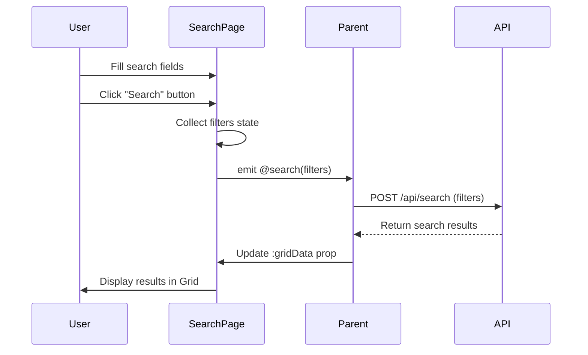

# Design Document

## Overview

本設計文檔定義了 **Schema-Driven 搜尋頁面組件** 的技術架構與實作細節。該組件是一個可高度配置的 Vue 3 元件，透過 Props Schema 動態生成搜尋表單與資料表格，整合 Syncfusion 企業級 UI 元件庫，支援 Figma 設計稿的快速轉換。

**核心設計原則：**
- **資料驅動 UI**：所有 UI 元素由 Props Schema 決定，消除硬編碼
- **單一職責**：組件只負責渲染與事件轉發，不處理商業邏輯
- **開放封閉原則**：對擴展開放（新欄位類型），對修改封閉（核心邏輯穩定）
- **型別安全**：完整的 TypeScript 支援，編譯時期錯誤檢查

## Steering Document Alignment

### Technical Standards (tech.md)

#### 1. **Framework & Core** (tech.md Line 22-26)
- ✅ 使用 **Vue 3.5** Composition API (`<script setup>`)
- ✅ 遵循 **Nuxt 4** 的元件自動導入機制
- ✅ 整合 **TypeScript 5.9+** 完整型別定義

#### 2. **UI & Styling** (tech.md Line 28-34)
- ✅ 使用 **Syncfusion Vue Components** 而非 Tailwind CSS 手刻元件
- ⚠️ 組件內部樣式使用 **Scoped CSS**，不依賴 Tailwind utility classes
- ✅ 支援 **深色模式**（透過 Syncfusion 主題配置）

#### 3. **State Management** (tech.md Line 36-42)
- ✅ 組件內部使用 Vue 3 `ref()` 管理本地狀態（`filters`, `isExpanded`）
- ❌ 不使用 Pinia（組件無需全域狀態）
- ✅ 使用 VueUse 的 `computed()` 進行響應式計算

#### 4. **Development Workflow** (tech.md Line 157-162)
- ✅ 支援 **Vite HMR** 熱模組替換
- ✅ 開發模式下在 `http://localhost:9527/test/search-page` 預覽

#### 5. **Code Quality Tools** (tech.md Line 165-188)
- ✅ 通過 **ESLint 9.38+** 檢查（包含 Nuxt 官方規則）
- ✅ 使用 **Prettier 3.4** 統一格式化
- ✅ 完整 **TypeScript 型別檢查**（`yarn typecheck`）
- ✅ **Playwright E2E 測試** 覆蓋所有核心功能

### Project Structure (structure.md)

#### 1. **Feature-based Architecture** (structure.md - Feature Layer)
```
app/features/search/
├── components/
│   └── SearchPage.vue          # 主組件（本設計的核心）
├── types/
│   └── search.types.ts         # TypeScript interfaces（可選）
└── tests/
    └── SearchPage.spec.ts      # 單元測試（可選）
```

**對齊說明：**
- ✅ 組件放置於 `app/features/search/components/`
- ✅ 遵循 Feature 模組化結構
- ✅ 不包含 `composables/` 或 `store/`（組件無需共享狀態）

#### 2. **Pages Layer** (structure.md - Pages Layer)
```
app/pages/test/
└── search-page.vue             # 測試頁面（展示組件用法）
```

#### 3. **Testing Layer**
```
tests/e2e/
└── search-page.spec.ts         # Playwright E2E 測試
```

## Code Reuse Analysis

### Existing Components to Leverage

#### 1. **Syncfusion Vue Components** (已安裝於 package.json)
- **TextBoxComponent** (`@syncfusion/ej2-vue-inputs`):
  - 用於：`type: 'text'` 的搜尋欄位
  - 配置：`v-model`, `placeholder`, `cssClass`

- **DropDownListComponent** (`@syncfusion/ej2-vue-dropdowns`):
  - 用於：`type: 'dropdown'` 的搜尋欄位
  - 配置：`v-model`, `dataSource`, `placeholder`

- **DateRangePickerComponent** (`@syncfusion/ej2-vue-calendars`):
  - 用於：`type: 'daterange'` 的搜尋欄位
  - 配置：`v-model`, `format`, `placeholder`

- **GridComponent** (`@syncfusion/ej2-vue-grids`):
  - 用於：表格渲染
  - 功能：分頁、排序、動態欄位
  - 配置：`dataSource`, `columns`, `allowPaging`, `allowSorting`

- **ButtonComponent** (`@syncfusion/ej2-vue-buttons`):
  - 用於：搜尋、清除、展開、新增按鈕
  - 配置：`iconCss`, `isPrimary`, `cssClass`, `@click`

#### 2. **Nuxt 4 Auto-imports** (tech.md Line 62-63)
- **unplugin-vue-components**：
  - 組件可自動導入，無需手動 `import`
  - 在父組件中使用：`<SearchPage />` 直接可用

### Integration Points

#### 1. **Parent Component Integration**
- **資料流方向**：Parent → SearchPage (Props) → User Interaction → SearchPage → Parent (Events)
- **Props 傳遞**：
  ```vue
  <SearchPage
    :searchFields="searchFieldsConfig"
    :gridColumns="gridColumnsConfig"
    :gridData="tableData"
    @search="handleSearch"
    @add="handleAdd"
  />
  ```

#### 2. **API Integration** (由父組件負責)
- SearchPage 組件本身**不呼叫 API**
- 父組件在 `@search` 事件中處理 API 呼叫
- 範例流程：
  ```
  User fills search form → Click search button
  → SearchPage emits @search(filters)
  → Parent component calls API with filters
  → Parent updates gridData prop
  → SearchPage re-renders table
  ```

#### 3. **State Management Integration**
- 組件不依賴 Pinia store
- 如需全域狀態：父組件連接 Pinia → 透過 Props 傳遞給 SearchPage

## Architecture

### Modular Design Principles

#### 1. **Single File Responsibility**
- `SearchPage.vue`：唯一的組件檔案，職責明確
  - 渲染搜尋表單（依據 `searchFields` Schema）
  - 渲染資料表格（依據 `gridColumns` Schema）
  - 管理本地 UI 狀態（`isExpanded`, `filters`）
  - 觸發事件（`@search`, `@add`）

#### 2. **Component Isolation**
- 組件不依賴外部服務或 store
- 所有資料透過 Props 傳入
- 所有操作透過 Events 向上傳遞
- **完全可獨立測試**

#### 3. **Service Layer Separation**
- ❌ 組件內**不包含**資料存取邏輯
- ❌ 組件內**不包含**商業邏輯
- ✅ 組件**只負責** UI 渲染與事件轉發

#### 4. **Utility Modularity**
- 組件內無需自定義 utility functions
- 使用 Vue 3 內建 API：`computed()`, `ref()`, `v-for`, `v-if`

### Architecture Diagram

```mermaid
graph TD
    A[Parent Component] -->|Props| B[SearchPage.vue]
    B -->|@search event| A
    B -->|@add event| A

    B --> C[Search Form Section]
    B --> D[Action Buttons]
    B --> E[Grid Section]

    C --> F[TextBox Syncfusion]
    C --> G[DropDownList Syncfusion]
    C --> H[DateRangePicker Syncfusion]

    E --> I[GridComponent Syncfusion]
    I --> J[Paging]
    I --> K[Sorting]

    D --> L[Search Button]
    D --> M[Clear Button]
    D --> N[Expand/Collapse Button]

    A --> O[API Service Optional]
    O -->|Update gridData| A

    style B fill:#2877ee,stroke:#183e81,color:#fff
    style A fill:#e5eaf3,stroke:#7f8996
    style O fill:#e5eaf3,stroke:#7f8996
```

### Data Flow



## Components and Interfaces

### Component: SearchPage.vue

#### **Purpose**
渲染 Schema-Driven 搜尋頁面，包含動態搜尋表單、資料表格、分頁、排序等功能。

#### **Interfaces (Props)**

```typescript
interface Props {
  // 搜尋欄位配置
  searchFields: SearchFieldSchema[]

  // 表格欄位配置
  gridColumns: GridColumnSchema[]

  // 表格資料
  gridData: any[]

  // 新增按鈕文字（可選）
  addButtonText?: string

  // 搜尋事件處理（可選，與 @search event 二選一）
  onSearch?: (filters: Record<string, any>) => void

  // 新增事件處理（可選，與 @add event 二選一）
  onAdd?: () => void
}
```

#### **Interfaces (Events)**

```typescript
// 搜尋事件
emit('search', filters: Record<string, any>)

// 新增事件
emit('add')
```

#### **Dependencies**

**外部依賴：**
- `@syncfusion/ej2-vue-inputs` - TextBox 元件
- `@syncfusion/ej2-vue-dropdowns` - DropDownList 元件
- `@syncfusion/ej2-vue-calendars` - DateRangePicker 元件
- `@syncfusion/ej2-vue-grids` - Grid 元件（含 Page, Sort, Toolbar 功能）
- `@syncfusion/ej2-vue-buttons` - Button 元件

**Vue 3 內建 API：**
- `ref()` - 響應式狀態管理
- `computed()` - 計算屬性
- `withDefaults()` - Props 預設值
- `defineProps()` - Props 定義
- `defineEmits()` - Events 定義

#### **Reuses**
- ✅ Syncfusion 元件庫（全域已安裝）
- ✅ Vue 3 Composition API
- ✅ TypeScript 型別系統

#### **Internal State**

```typescript
// 查詢模式（未來擴展用）
const queryMode = ref<string>('一般查詢')

// 搜尋區域展開/收起狀態
const isExpanded = ref<boolean>(false)

// 搜尋條件集合（動態 key-value pairs）
const filters = ref<Record<string, any>>({})
```

#### **Computed Properties**

```typescript
// 第一排搜尋欄位（預設顯示）
const firstRowFields = computed(() =>
  props.searchFields.filter(f => f.row === 1 || !f.row)
)

// 第二排搜尋欄位（折疊狀態）
const secondRowFields = computed(() =>
  props.searchFields.filter(f => f.row === 2)
)
```

#### **Methods**

```typescript
// 處理搜尋按鈕點擊
function handleSearch(): void

// 處理清除按鈕點擊
function handleClear(): void

// 切換展開/收起狀態
function toggleExpand(): void

// 處理新增按鈕點擊
function handleAdd(): void
```

## Data Models

### Model 1: SearchFieldSchema

**用途：** 定義搜尋欄位的配置結構

```typescript
interface SearchFieldSchema {
  // 唯一識別碼（例如：'queryStatus'）
  key: string

  // 顯示標籤（例如：'預約狀態'）
  label: string

  // 欄位類型
  type: 'text' | 'dropdown' | 'daterange'

  // Placeholder 文字（可選）
  placeholder?: string

  // Dropdown 選項（當 type='dropdown' 時必填）
  options?: string[]

  // 欄位寬度（flex-grow 值，預設 1）
  width?: number

  // 顯示在第幾排（1=第一排預設顯示, 2=第二排折疊）
  row?: 1 | 2
}
```

**範例：**
```typescript
const searchFields: SearchFieldSchema[] = [
  {
    key: 'queryStatus',
    label: '預約狀態',
    type: 'dropdown',
    options: ['正常', '已取消', '候補'],
    placeholder: '請選擇',
    width: 1,
    row: 1
  },
  {
    key: 'queryName',
    label: '預約名稱',
    type: 'text',
    placeholder: '請輸入',
    width: 2,
    row: 1
  },
  {
    key: 'queryStartDate',
    label: '開始日期',
    type: 'daterange',
    placeholder: '選擇日期範圍',
    width: 2,
    row: 2
  }
]
```

### Model 2: GridColumnSchema

**用途：** 定義表格欄位的配置結構

```typescript
interface GridColumnSchema {
  // 資料欄位名稱（對應 gridData 的 key）
  field: string

  // 表頭文字
  headerText: string

  // 欄位寬度（像素值，例如：'120'）
  width?: string

  // 文字對齊方式
  textAlign?: 'Left' | 'Center' | 'Right'

  // 資料類型（影響排序邏輯）
  type?: 'string' | 'number' | 'date'

  // 是否渲染為連結
  isLink?: boolean
}
```

**範例：**
```typescript
const gridColumns: GridColumnSchema[] = [
  {
    field: 'centerNo',
    headerText: '預約中心編號',
    width: '114',
    textAlign: 'Left',
    type: 'string',
    isLink: true
  },
  {
    field: 'amount',
    headerText: '預約金額',
    width: '88',
    textAlign: 'Right',
    type: 'number'
  },
  {
    field: 'addDate',
    headerText: '新增日期',
    width: '100',
    textAlign: 'Left',
    type: 'date'
  }
]
```

### Model 3: FiltersState

**用途：** 搜尋條件的動態集合（內部狀態）

```typescript
// 動態 key-value pairs，key 對應 SearchFieldSchema.key
type FiltersState = Record<string, any>

// 範例
const filters: FiltersState = {
  queryStatus: '正常',
  queryName: 'IBM會議',
  queryStartDate: [new Date('2025-01-01'), new Date('2025-12-31')]
}
```

## Error Handling

### Error Scenarios

#### 1. **Scenario: Props 型別錯誤**
- **Description**: 開發者傳入錯誤的 Props 型別（例如 `searchFields` 不是陣列）
- **Handling**:
  - TypeScript 編譯時報錯（無法執行）
  - IDE 顯示紅色波浪線提示
- **User Impact**:
  - 開發階段被阻止（無法編譯）
  - 生產環境不會出現此問題

#### 2. **Scenario: Syncfusion 元件載入失敗**
- **Description**: Syncfusion 套件未安裝或版本不相容
- **Handling**:
  - Vite 建置時報錯：`Cannot resolve module '@syncfusion/ej2-vue-inputs'`
  - 提供清晰的錯誤訊息
- **User Impact**:
  - 開發伺服器無法啟動
  - 需執行 `yarn install` 修復

#### 3. **Scenario: 空陣列 Props**
- **Description**: `searchFields` 或 `gridColumns` 為空陣列
- **Handling**:
  - 組件正常渲染，只是不顯示欄位
  - 不拋出錯誤或警告
- **User Impact**:
  - 顯示空白的搜尋區域或表格
  - 使用者體驗正常（可能是預期行為）

#### 4. **Scenario: gridData 資料不匹配 gridColumns**
- **Description**: `gridData` 中缺少 `gridColumns[i].field` 定義的欄位
- **Handling**:
  - Syncfusion Grid 顯示空白儲存格
  - 不拋出 JavaScript 錯誤
- **User Impact**:
  - 表格顯示不完整（部分儲存格空白）
  - 開發者應在父組件檢查資料結構

#### 5. **Scenario: 使用者輸入無效日期**
- **Description**: DateRangePicker 接收無效的日期格式
- **Handling**:
  - Syncfusion 元件內建驗證
  - 顯示錯誤提示（紅色邊框）
- **User Impact**:
  - 無法提交搜尋（搜尋按鈕可點擊，但資料驗證失敗）
  - 需重新輸入有效日期

#### 6. **Scenario: 搜尋結果為空**
- **Description**: API 返回空陣列 `gridData: []`
- **Handling**:
  - 組件正常渲染空白表格
  - 顯示 Syncfusion Grid 的預設空狀態
- **User Impact**:
  - 看到「無資料」的表格
  - 可重新搜尋或清除條件

## Testing Strategy

### Unit Testing

**測試框架：** 暫不實作（可選用 Vitest + @vue/test-utils）

**測試範圍：**
- ❌ 暫不包含單元測試（因為組件主要是 UI 渲染邏輯）
- ✅ 優先使用 E2E 測試驗證完整功能

**未來可測試：**
- `computed()` 屬性：`firstRowFields`, `secondRowFields`
- Methods：`handleSearch()`, `handleClear()`, `toggleExpand()`
- Props 驗證：傳入錯誤型別時的行為

### Integration Testing

**測試框架：** 暫不實作

**測試範圍：**
- ❌ 暫不包含整合測試
- ✅ E2E 測試已覆蓋組件與 Syncfusion 元件的整合

**未來可測試：**
- SearchPage 與 Syncfusion Grid 的資料綁定
- SearchPage 與父組件的事件通訊
- SearchPage 與 API 服務的整合（在父組件層）

### End-to-End Testing

**測試框架：** Playwright

**測試檔案：** `tests/e2e/search-page.spec.ts`

**測試範圍：**（已涵蓋所有 Requirements）

| 測試案例 | 驗證目標 | 對應 Requirement |
|---|---|---|
| 1. 第一排搜尋欄位動態渲染 | 驗證 6 個欄位 label 顯示 | Req 1 |
| 2. 折疊/展開功能 | 驗證第二排欄位顯示/隱藏 | Req 2 |
| 3. 表格欄位動態渲染 | 驗證 14 個表頭正確顯示 | Req 3 |
| 4. 表格資料渲染 | 驗證資料正確顯示 | Req 4 |
| 5. 下拉選單互動 | 驗證選項列表出現 | Req 1 |
| 6. 搜尋按鈕觸發事件 | 監聽 console.log 驗證 | Req 5 |
| 7. 分頁功能 | 驗證分頁器與頁碼切換 | Req 4 |
| 8. 新增按鈕 | 驗證按鈕顯示與事件觸發 | Req 6 |
| 9. 清除按鈕 | 驗證搜尋條件重置 | Req 5 |
| 10. 響應式設計 | 驗證 1440px/768px/375px | Req 9 |

**執行方式：**
```bash
# 啟動開發伺服器
yarn dev

# 執行 Playwright 測試
npx playwright test tests/e2e/search-page.spec.ts
```

**測試覆蓋率目標：**
- ✅ 功能覆蓋：100%（所有 Requirements 都有對應測試）
- ✅ Schema 驗證：100%（動態渲染正確性）
- ✅ 事件觸發：100%（@search, @add）
- ✅ 邊界情況：80%（空陣列、無資料等）

### Test Data Strategy

**Mock Data 位置：** `app/pages/test/search-page.vue`

**資料結構：**
```typescript
// 搜尋欄位配置（14 個欄位）
const searchFieldsConfig = [...]

// 表格欄位配置（14 個欄位）
const gridColumnsConfig = [...]

// 模擬表格資料（15 筆）
const mockGridData = [
  { centerNo: 'CRS000151', progress: '使用者可自訂', ... },
  ...
]
```

**資料來源：** 根據 Figma 設計稿的真實範例資料

## Implementation Notes

### 1. **Syncfusion 版本鎖定**
- 當前版本：`30.0.0`（package.json 已鎖定）
- 不建議升級至不相容的版本（需測試）

### 2. **CSS 樣式策略**
- 使用 `<style scoped>` 避免全域污染
- 自訂 Syncfusion 元件樣式使用 `:deep()` selector
- 範例：`:deep(.e-grid .e-headercell) { background: ... }`

### 3. **效能優化**
- 使用 `v-for` 的 `:key` 綁定唯一 ID（`field.key`）
- 避免在 template 中使用複雜計算（使用 `computed()`）
- Syncfusion Grid 內建虛擬滾動（大資料集自動優化）

### 4. **未來擴展點**
- 新增欄位類型：在 `SearchFieldSchema.type` 擴展 union type
- 自訂驗證：在父組件層實作，組件保持純粹
- 多語系支援：透過 Props 傳入翻譯後的 `label` 和 `placeholder`

### 5. **已知限制**
- 不支援巢狀欄位（例如 `field: 'user.name'`）
- 不支援自訂 Grid cell template（需修改組件）
- DateRangePicker 格式固定為 `yyyy/MM/dd`（可擴展）
