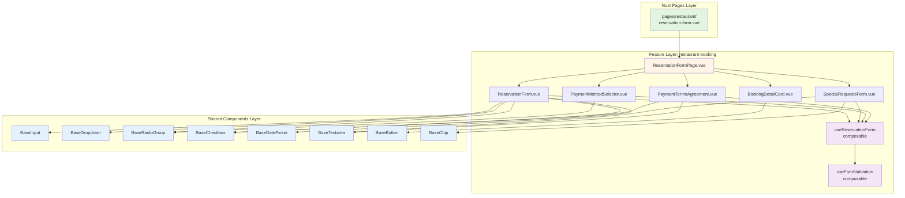

# Design Document

## Overview

本設計文檔詳細說明如何將 Figma「預約資料頁/候補/PC」設計稿（Frame ID: 5006:11441）轉換為符合專案架構的 Vue 元件，並透過 Playwright MCP 進行視覺回歸測試。

### 設計稿資訊
- **Frame Name**: 預約資料頁/候補/PC
- **Frame ID**: 5006:11441
- **尺寸**: 1920 x 2147 px (PC Desktop)
- **主要區塊**:
  - Header (麵包屑 + 導航列) - 80px 高
  - Content Container - 2067px 高
    - Left: 預約表單區 (949px 寬)
    - Right: 預約詳情卡片 (459px 寬)

### 技術堆疊轉換
Figma MCP 產生的是 **React + Tailwind CSS** 代碼，需轉換為專案使用的 **Vue 3 + Nuxt 4 + Tailwind CSS v4**。

**轉換要點**:
1. React 語法 → Vue 3 Composition API (`<script setup>`)
2. className → class
3. React hooks → Vue composables
4. Props/Events → Vue defineProps/defineEmits
5. 保留所有 Tailwind classes（已支援 v4）
6. 保留 data-node-id 屬性（用於測試定位）

## Steering Document Alignment

### Technical Standards (tech.md)

#### 遵循的技術標準

1. **Feature-based 架構**
   - 建立 `app/features/restaurant-booking/` 模組
   - 包含 pages、components、composables、types

2. **Tailwind CSS v4 整合**
   - 使用 `@tailwindcss/postcss` (專案已配置)
   - CSS variables 對應 Figma Design Tokens
   - 深色模式支援（class-based）

3. **TypeScript 型別安全**
   - 所有元件使用 TypeScript
   - Props/Emits 型別定義
   - 表單資料型別定義

4. **Nuxt 自動導入**
   - Shared components 自動註冊
   - Composables 自動導入
   - Feature 元件透過 barrel exports 匯出

#### Figma Design Tokens 提取

從 Figma 代碼中提取的設計 tokens：

**Colors** (CSS Variables):
```css
--primary-darker: #001d5a         /* Header 背景 */
--primary-on-primary: #ffffff     /* Header 文字 */
--primary-primary: #2877ee        /* 主色調（按鈕、連結、邊框） */
--secondary-secondary: #6a6f7b    /* 次要文字 */
--secondary-on-secondary: #ffffff /* 次要文字（深色背景） */
--secondary-secondary-container: #b5c7e4  /* 選中狀態底色 */
--tertiary-tertiary-container: #fff2c2    /* 警告背景 */
--tertiary-on-tertiary-container: #2d2000 /* 警告文字 */
--background: #f4f7fe             /* 頁面背景 */
--surface: #ffffff                /* 卡片背景 */
--on-surface: #0f172a             /* 主要文字 */
--on-surface-variant: #3c4a5b     /* 次要資訊文字 */
--outline-variant: #d7dae0        /* 邊框、分隔線 */
--outline: #7f8996                /* 禁用狀態文字 */
--error: #f4493e                  /* 錯誤、必填標示 */
--disable: rgba(98,91,113,0.16)   /* 禁用背景 */
```

**Typography**:
```
- Font Family: 'Noto Sans CJK TC' (繁體中文)
- Font Weights: Regular (400), Medium (500), Bold (700)
- Font Sizes:
  - 24px: 標題 (h2)
  - 16px: 內文、表單 label
  - 14px: 小型提示文字
- Line Heights: 1.5 (24px), normal (16px)
```

**Spacing**:
```
- Gap: 4px, 8px, 16px, 24px, 32px
- Padding: 8px, 16px, 24px
- Border Radius: 4px (checkbox), 6px, 8px, 10px (card)
- Border Width: 1px, 2px
```

**需更新至 `tailwind.config.ts`**:
```typescript
export default {
  theme: {
    extend: {
      colors: {
        // 新增專案特定顏色
        'primary-darker': '#001d5a',
        'primary': '#2877ee',
        'secondary': '#6a6f7b',
        'error': '#f4493e',
        // ... 其他顏色
      },
      fontFamily: {
        'noto-sans-tc': ['Noto Sans CJK TC', 'sans-serif'],
      },
    },
  },
}
```

### Project Structure (structure.md)

#### 檔案組織規劃

遵循 Feature-based 架構：

```
app/
├── features/
│   └── restaurant-booking/           # 新功能模組
│       ├── pages/
│       │   └── ReservationFormPage.vue  # 完整頁面
│       ├── components/
│       │   ├── ReservationForm.vue      # 預訂人資料表單
│       │   ├── SpecialRequestsForm.vue  # 特殊需求表單
│       │   ├── PaymentMethodSelector.vue # 付款方式選擇器
│       │   ├── PaymentTermsAgreement.vue # 付款條款同意區塊
│       │   └── BookingDetailCard.vue     # 預約詳情卡片
│       ├── composables/
│       │   ├── useReservationForm.ts     # 表單邏輯
│       │   └── useFormValidation.ts      # 表單驗證
│       ├── types/
│       │   └── reservation.types.ts      # 型別定義
│       ├── __tests__/
│       │   ├── visual/                   # 視覺回歸測試
│       │   │   ├── reservation-form.spec.ts
│       │   │   └── booking-detail-card.spec.ts
│       │   └── unit/                     # 單元測試（未來）
│       └── index.ts                      # Barrel exports
│
├── shared/
│   └── components/
│       ├── form/                         # 表單元件
│       │   ├── BaseInput.vue            # 文字輸入框
│       │   ├── BaseDropdown.vue         # 下拉選單
│       │   ├── BaseRadioGroup.vue       # 單選按鈕群組
│       │   ├── BaseCheckbox.vue         # 核取方塊
│       │   ├── BaseDatePicker.vue       # 日期選擇器
│       │   ├── BaseTextarea.vue         # 多行文字輸入
│       │   ├── BaseChip.vue             # 標籤/晶片
│       │   └── BaseButton.vue           # 按鈕
│       └── ui/                           # UI 元件
│           ├── Alert.vue                # 警告提示框
│           └── Card.vue                 # 卡片容器
│
└── pages/
    └── restaurant/
        └── reservation-form.vue         # Nuxt 路由頁面
```

#### 命名規範

遵循 `structure.md` 規範：

| 類型 | 規範 | 範例 |
|-----|------|------|
| Vue 元件 | PascalCase | `ReservationForm.vue` |
| Composables | use + camelCase | `useReservationForm.ts` |
| Types | PascalCase | `ReservationData` |
| Props | camelCase | `firstName`, `isRequired` |
| Events | kebab-case | `@submit`, `@update:model-value` |

## Code Reuse Analysis

### Existing Components to Leverage

專案目前為起始模板，尚無既有元件可重用。本次實作將建立**第一批共用元件**，作為未來專案的基礎。

### 新建元件清單

#### Shared Components (8 個)

1. **BaseInput.vue** - 文字輸入框
   - 支援 v-model
   - 必填標示 (`*`)
   - 錯誤狀態
   - Placeholder

2. **BaseDropdown.vue** - 下拉選單
   - 支援 v-model
   - 選項列表
   - 鍵盤導航

3. **BaseRadioGroup.vue** - 單選按鈕群組
   - 支援 v-model
   - 水平/垂直排列

4. **BaseCheckbox.vue** - 核取方塊
   - 支援 v-model
   - Label 文字
   - 禁用狀態

5. **BaseDatePicker.vue** - 日期選擇器
   - 支援 v-model (Date)
   - 日曆彈窗
   - 最小/最大日期限制

6. **BaseTextarea.vue** - 多行文字輸入
   - 支援 v-model
   - 可調整大小

7. **BaseButton.vue** - 按鈕
   - Variants: primary, secondary, outline, ghost
   - Sizes: sm, md, lg
   - Loading 狀態
   - 禁用狀態

8. **BaseChip.vue** - 標籤/晶片
   - 可選中狀態
   - 關閉按鈕（選用）

#### Feature Components (5 個)

1. **ReservationForm.vue** - 預訂人資料表單
   - 包含：姓、名、稱謂、性別、生日、手機、信箱
   - 表單驗證

2. **SpecialRequestsForm.vue** - 特殊需求表單
   - 預訂目的選擇（chips）
   - 其他備註（textarea）

3. **PaymentMethodSelector.vue** - 付款方式選擇器
   - 4 種付款方式單選
   - PayPal 圖示顯示

4. **PaymentTermsAgreement.vue** - 付款條款同意區塊
   - 條款內容捲動區域
   - 同意核取方塊

5. **BookingDetailCard.vue** - 預約詳情卡片
   - 餐廳圖片
   - 餐廳資訊（名稱、地址、電話）
   - 預約資訊（日期、時間、人數）
   - 上一步/登記候補按鈕

### Integration Points

#### Figma MCP 整合
- **工具**: `get_design_context` - 取得完整設計上下文
- **工具**: `get_screenshot` - 取得設計稿截圖作為視覺基準
- **工具**: `get_variable_defs` - 取得 Design Tokens (如有)

#### Playwright MCP 整合
- **工具**: `browser_snapshot` - 可訪問性快照
- **工具**: `browser_take_screenshot` - 元件截圖
- **工具**: `browser_fill_form` - 表單填寫
- **工具**: `browser_click` - 點擊互動
- **工具**: `browser_select_option` - 下拉選擇

## Architecture

### 整體架構圖



### Modular Design Principles

#### 1. Single File Responsibility

每個元件檔案只負責一個 UI 功能：

- ✅ **BaseInput.vue** - 只處理單一文字輸入框
- ✅ **ReservationForm.vue** - 只處理預訂人資料表單區塊
- ✅ **useReservationForm.ts** - 只處理表單狀態管理

#### 2. Component Isolation

Shared components 完全獨立，無業務邏輯：

```vue
<!-- BaseInput.vue - Dumb Component -->
<script setup lang="ts">
interface Props {
  modelValue: string
  label?: string
  placeholder?: string
  required?: boolean
  error?: string
}

const props = defineProps<Props>()
const emit = defineEmits<{
  'update:modelValue': [value: string]
}>()
</script>
```

Feature components 封裝業務邏輯：

```vue
<!-- ReservationForm.vue - Smart Component -->
<script setup lang="ts">
import { useReservationForm } from '../composables/useReservationForm'

const { formData, errors, validate } = useReservationForm()
</script>
```

#### 3. Service Layer Separation

- **Presentation (Vue Components)**: 只負責 UI 渲染與事件處理
- **Business Logic (Composables)**: 封裝表單驗證、狀態管理
- **Data (Types)**: 型別定義與介面

```typescript
// types/reservation.types.ts - Data Layer
export interface ReservationData {
  firstName: string
  lastName: string
  title: string
  gender: string
  birthday: Date | null
  phoneCountry: string
  phoneNumber: string
  email: string
  saveInfo: boolean
}

// composables/useReservationForm.ts - Business Logic Layer
export function useReservationForm() {
  const formData = ref<ReservationData>({
    firstName: '',
    lastName: '',
    // ...
  })

  const validate = () => {
    // 驗證邏輯
  }

  return { formData, validate }
}

// components/ReservationForm.vue - Presentation Layer
// 使用 composable，只負責渲染
```

#### 4. Utility Modularity

表單驗證工具模組化：

```typescript
// composables/useFormValidation.ts
export function useFormValidation() {
  const validateEmail = (email: string) => {
    const regex = /^[^\s@]+@[^\s@]+\.[^\s@]+$/
    return regex.test(email)
  }

  const validatePhone = (phone: string) => {
    return /^09\d{8}$/.test(phone)
  }

  return { validateEmail, validatePhone }
}
```

## Components and Interfaces

### Shared Components

#### 1. BaseInput

**Purpose**: 可重用的文字輸入框元件

**Props**:
```typescript
interface Props {
  modelValue: string                    // v-model 綁定
  label?: string                         // Label 文字
  placeholder?: string                   // Placeholder
  required?: boolean                     // 是否必填
  error?: string                         // 錯誤訊息
  type?: 'text' | 'email' | 'tel'       // Input type
  disabled?: boolean                     // 禁用狀態
}
```

**Emits**:
```typescript
{
  'update:modelValue': [value: string]  // v-model 更新
}
```

**Reuses**: 無（基礎元件）

**檔案位置**: `app/shared/components/form/BaseInput.vue`

---

#### 2. BaseDropdown

**Purpose**: 可重用的下拉選單元件

**Props**:
```typescript
interface Option {
  label: string
  value: string | number
}

interface Props {
  modelValue: string | number | null    // v-model 綁定
  label?: string                         // Label 文字
  placeholder?: string                   // 未選擇時顯示文字
  options: Option[]                      // 選項列表
  required?: boolean                     // 是否必填
  error?: string                         // 錯誤訊息
  disabled?: boolean                     // 禁用狀態
}
```

**Emits**:
```typescript
{
  'update:modelValue': [value: string | number | null]
}
```

**Reuses**: 無

**檔案位置**: `app/shared/components/form/BaseDropdown.vue`

---

#### 3. BaseRadioGroup

**Purpose**: 可重用的單選按鈕群組

**Props**:
```typescript
interface RadioOption {
  label: string
  value: string | number
}

interface Props {
  modelValue: string | number | null    // v-model 綁定
  options: RadioOption[]                 // 選項列表
  name: string                           // Radio group name
  orientation?: 'horizontal' | 'vertical' // 排列方向
  disabled?: boolean                     // 禁用狀態
}
```

**Emits**:
```typescript
{
  'update:modelValue': [value: string | number]
}
```

**Reuses**: 無

**檔案位置**: `app/shared/components/form/BaseRadioGroup.vue`

---

#### 4. BaseCheckbox

**Purpose**: 可重用的核取方塊元件

**Props**:
```typescript
interface Props {
  modelValue: boolean                    // v-model 綁定
  label?: string                         // Label 文字
  disabled?: boolean                     // 禁用狀態
}
```

**Emits**:
```typescript
{
  'update:modelValue': [value: boolean]
}
```

**Reuses**: 無

**檔案位置**: `app/shared/components/form/BaseCheckbox.vue`

---

#### 5. BaseDatePicker

**Purpose**: 可重用的日期選擇器元件

**Props**:
```typescript
interface Props {
  modelValue: Date | null                // v-model 綁定
  label?: string                         // Label 文字
  placeholder?: string                   // Placeholder
  minDate?: Date                         // 最小日期
  maxDate?: Date                         // 最大日期
  disabled?: boolean                     // 禁用狀態
}
```

**Emits**:
```typescript
{
  'update:modelValue': [value: Date | null]
}
```

**Reuses**: 可考慮整合第三方庫（如 VueDatePicker）或自建

**檔案位置**: `app/shared/components/form/BaseDatePicker.vue`

---

#### 6. BaseTextarea

**Purpose**: 可重用的多行文字輸入元件

**Props**:
```typescript
interface Props {
  modelValue: string                     // v-model 綁定
  label?: string                         // Label 文字
  placeholder?: string                   // Placeholder
  rows?: number                          // 預設行數
  maxLength?: number                     // 最大字數
  resize?: boolean                       // 是否可調整大小
  disabled?: boolean                     // 禁用狀態
}
```

**Emits**:
```typescript
{
  'update:modelValue': [value: string]
}
```

**Reuses**: 無

**檔案位置**: `app/shared/components/form/BaseTextarea.vue`

---

#### 7. BaseButton

**Purpose**: 可重用的按鈕元件

**Props**:
```typescript
interface Props {
  variant?: 'primary' | 'secondary' | 'outline' | 'ghost'  // 樣式變體
  size?: 'sm' | 'md' | 'lg'             // 尺寸
  disabled?: boolean                     // 禁用狀態
  loading?: boolean                      // 載入狀態
  type?: 'button' | 'submit' | 'reset'  // Button type
}
```

**Emits**:
```typescript
{
  'click': []                            // 點擊事件
}
```

**Slots**:
- `default`: 按鈕文字內容

**Reuses**: 無

**檔案位置**: `app/shared/components/form/BaseButton.vue`

---

#### 8. BaseChip

**Purpose**: 可重用的標籤/晶片元件

**Props**:
```typescript
interface Props {
  label: string                          // 顯示文字
  selected?: boolean                     // 選中狀態
  closable?: boolean                     // 是否可關閉
  disabled?: boolean                     // 禁用狀態
}
```

**Emits**:
```typescript
{
  'click': []                            // 點擊事件
  'close': []                            // 關閉事件
}
```

**Reuses**: 無

**檔案位置**: `app/shared/components/form/BaseChip.vue`

---

### Feature Components

#### 1. ReservationForm

**Purpose**: 處理預訂人資料輸入

**Props**: 無（自包含狀態）

**Emits**:
```typescript
{
  'submit': [data: ReservationData]      // 表單提交
}
```

**Dependencies**:
- BaseInput
- BaseDropdown
- BaseRadioGroup
- BaseCheckbox
- BaseDatePicker

**Reuses**:
- `useReservationForm` composable - 表單狀態管理
- `useFormValidation` composable - 驗證邏輯

**Data Structure**:
```typescript
interface ReservationData {
  firstName: string          // 姓
  lastName: string           // 名
  title: string             // 稱謂
  gender: string            // 性別
  birthday: Date | null     // 生日
  phoneCountry: string      // 手機國碼
  phoneNumber: string       // 手機號碼
  email: string             // 信箱
  saveInfo: boolean         // 儲存資訊
}
```

**檔案位置**: `app/features/restaurant-booking/components/ReservationForm.vue`

---

#### 2. SpecialRequestsForm

**Purpose**: 處理特殊需求選擇與備註

**Props**: 無

**Emits**:
```typescript
{
  'submit': [data: SpecialRequestsData]
}
```

**Dependencies**:
- BaseChip
- BaseTextarea

**Reuses**:
- `useReservationForm` composable

**Data Structure**:
```typescript
interface SpecialRequestsData {
  purpose: string[]         // 預訂目的（多選）
  notes: string             // 其他備註
}
```

**檔案位置**: `app/features/restaurant-booking/components/SpecialRequestsForm.vue`

---

#### 3. PaymentMethodSelector

**Purpose**: 選擇付款方式

**Props**: 無

**Emits**:
```typescript
{
  'update:modelValue': [value: PaymentMethod]
}
```

**Dependencies**:
- BaseRadioGroup
- Alert (警告提示框)

**Data Structure**:
```typescript
type PaymentMethod = 'cash' | 'credit_card' | 'bank_transfer' | 'paypal'
```

**檔案位置**: `app/features/restaurant-booking/components/PaymentMethodSelector.vue`

---

#### 4. PaymentTermsAgreement

**Purpose**: 顯示付款條款並取得同意

**Props**: 無

**Emits**:
```typescript
{
  'agree': [agreed: boolean]
}
```

**Dependencies**:
- BaseCheckbox

**檔案位置**: `app/features/restaurant-booking/components/PaymentTermsAgreement.vue`

---

#### 5. BookingDetailCard

**Purpose**: 顯示預約詳情摘要

**Props**:
```typescript
interface Props {
  restaurantName: string
  address: string
  phone: string
  date: Date
  time: string
  guests: {
    adults: number
    children: number
    infants: number
    seniors: number
  }
  imageUrl?: string
}
```

**Emits**:
```typescript
{
  'back': []              // 上一步
  'submit': []            // 登記候補
}
```

**Dependencies**:
- BaseButton
- Icon components (calendar, clock, person, location, phone)

**檔案位置**: `app/features/restaurant-booking/components/BookingDetailCard.vue`

---

### Page Component

#### ReservationFormPage

**Purpose**: 整合所有表單元件的完整頁面

**Props**: 無

**Emits**: 無（處理提交邏輯）

**Dependencies**:
- ReservationForm
- SpecialRequestsForm
- PaymentMethodSelector
- PaymentTermsAgreement
- BookingDetailCard

**Layout**:
```
┌─────────────────────────────────────────────────┐
│ Header (Breadcrumb + Navigation)                │
├─────────────────────────────────────────────────┤
│ Page Title + Alert                              │
├───────────────────────────┬─────────────────────┤
│ Left Column (949px)       │ Right Column (459px)│
│ ┌───────────────────────┐ │ ┌─────────────────┐ │
│ │ ReservationForm       │ │ │ Booking Detail  │ │
│ └───────────────────────┘ │ │ Card            │ │
│ ┌───────────────────────┐ │ │                 │ │
│ │ SpecialRequestsForm   │ │ │                 │ │
│ └───────────────────────┘ │ │                 │ │
│ ┌───────────────────────┐ │ └─────────────────┘ │
│ │ PaymentMethodSelector │ │                     │
│ └───────────────────────┘ │                     │
│ ┌───────────────────────┐ │                     │
│ │ PaymentTermsAgreement │ │                     │
│ └───────────────────────┘ │                     │
│ Checkboxes (3)            │                     │
└───────────────────────────┴─────────────────────┘
```

**檔案位置**: `app/features/restaurant-booking/pages/ReservationFormPage.vue`

## Data Models

### ReservationData

完整的預約表單資料模型：

```typescript
// app/features/restaurant-booking/types/reservation.types.ts

export interface ReservationData {
  // 預訂人資料
  firstName: string
  lastName: string
  title: string                    // '先生' | '小姐' | '女士' | 其他
  gender: string                   // '男生' | '女生' | '多元性別' | '保密'
  birthday: Date | null
  phoneCountry: string             // '+886'
  phoneNumber: string              // '0912345678'
  email: string
  saveInfo: boolean

  // 特殊需求
  purpose: string[]                // ['生日', '結婚週年', ...]
  notes: string

  // 付款方式
  paymentMethod: PaymentMethod

  // 同意事項
  agreePaymentTerms: boolean
  agreePrivacyPolicy: boolean
  agreeReservationPolicy: boolean
  agreeWaitlistPolicy: boolean
}

export type PaymentMethod = 'cash' | 'credit_card' | 'bank_transfer' | 'paypal'

export interface ValidationErrors {
  firstName?: string
  lastName?: string
  title?: string
  birthday?: string
  phoneNumber?: string
  email?: string
  paymentMethod?: string
  agreePaymentTerms?: string
  agreePrivacyPolicy?: string
  agreeReservationPolicy?: string
  agreeWaitlistPolicy?: string
}
```

### BookingInfo

預約詳情資料模型：

```typescript
export interface BookingInfo {
  restaurant: {
    name: string
    address: string
    phone: string
    imageUrl?: string
  }
  booking: {
    date: Date
    time: string                   // '18:00'
    guests: {
      adults: number
      children: number
      infants: number
      seniors: number
    }
  }
}
```

## Error Handling

### Error Scenarios

#### 1. 表單驗證錯誤

**Scenario**: 使用者提交表單時，必填欄位為空或格式不正確

**Handling**:
```typescript
const validate = () => {
  const errors: ValidationErrors = {}

  if (!formData.value.firstName.trim()) {
    errors.firstName = '請輸入姓氏'
  }

  if (!formData.value.email.match(/^[^\s@]+@[^\s@]+\.[^\s@]+$/)) {
    errors.email = '信箱格式不正確'
  }

  if (!formData.value.agreePaymentTerms) {
    errors.agreePaymentTerms = '請同意付款規範'
  }

  return errors
}
```

**User Impact**:
- 錯誤訊息顯示在對應欄位下方（紅色文字）
- 輸入框邊框變為紅色
- 頁面不跳轉，focus 到第一個錯誤欄位

#### 2. 網路請求失敗

**Scenario**: API 請求失敗（未來實作）

**Handling**:
```typescript
try {
  await submitReservation(formData.value)
} catch (error) {
  // 顯示全域錯誤提示
  showError('提交失敗，請稍後再試')
}
```

**User Impact**:
- 顯示錯誤 toast 通知
- 保留表單資料，不清空
- 提供重試按鈕

#### 3. 瀏覽器不支援

**Scenario**: 使用者使用過舊的瀏覽器

**Handling**:
- 使用 `@nuxtjs/device` 偵測瀏覽器
- 顯示升級提示

**User Impact**:
- 顯示警告橫幅：「建議使用 Chrome 90+ 以獲得最佳體驗」

#### 4. LocalStorage 失敗

**Scenario**: 使用者選擇「儲存資訊」但 LocalStorage 不可用

**Handling**:
```typescript
const saveToLocalStorage = (data: ReservationData) => {
  try {
    localStorage.setItem('reservation_info', JSON.stringify(data))
  } catch (error) {
    console.warn('無法儲存資訊', error)
    // 靜默失敗，不影響主要流程
  }
}
```

**User Impact**:
- 功能靜默失敗
- 不影響表單提交

## Testing Strategy

### Unit Testing (未來實作)

**工具**: Vitest + @vue/test-utils

**測試範圍**:
- Composables 邏輯測試
- 表單驗證函式測試

**範例**:
```typescript
// __tests__/unit/useFormValidation.test.ts
import { describe, it, expect } from 'vitest'
import { useFormValidation } from '../composables/useFormValidation'

describe('useFormValidation', () => {
  it('should validate email correctly', () => {
    const { validateEmail } = useFormValidation()
    expect(validateEmail('test@example.com')).toBe(true)
    expect(validateEmail('invalid')).toBe(false)
  })
})
```

### Integration Testing (未來實作)

**工具**: Playwright (非 MCP，純 E2E)

**測試流程**:
1. 填寫完整表單
2. 驗證提交成功
3. 驗證資料傳遞正確

### Visual Regression Testing (本次重點)

**工具**: Playwright MCP

**測試策略**:

#### 1. Component-level Tests

測試每個 Shared Component 的視覺呈現：

**檔案**: `app/shared/components/form/__tests__/visual/BaseInput.spec.ts`

```typescript
import { test, expect } from '@playwright/test'

test.describe('BaseInput Visual Tests', () => {
  test('default state', async ({ page }) => {
    await page.goto('/test/base-input?state=default')

    // 使用 Playwright MCP browser_take_screenshot
    await page.screenshot({
      path: 'screenshots/BaseInput-default.png'
    })

    // 比對基準截圖
    await expect(page).toHaveScreenshot('BaseInput-default.png')
  })

  test('focus state', async ({ page }) => {
    await page.goto('/test/base-input')
    await page.locator('input').focus()
    await expect(page).toHaveScreenshot('BaseInput-focus.png')
  })

  test('error state', async ({ page }) => {
    await page.goto('/test/base-input?state=error')
    await expect(page).toHaveScreenshot('BaseInput-error.png')
  })

  test('disabled state', async ({ page }) => {
    await page.goto('/test/base-input?state=disabled')
    await expect(page).toHaveScreenshot('BaseInput-disabled.png')
  })
})
```

**測試狀態清單**:

| Component | States to Test |
|-----------|----------------|
| BaseInput | default, focus, filled, error, disabled |
| BaseDropdown | closed, open, selected, disabled |
| BaseCheckbox | unchecked, checked, disabled |
| BaseDatePicker | closed, calendar-open, date-selected |
| BaseButton | default, hover, active, disabled, loading |
| BaseChip | unselected, selected, disabled |

#### 2. Page-level Tests

測試完整頁面：

**檔案**: `app/features/restaurant-booking/__tests__/visual/ReservationFormPage.spec.ts`

```typescript
import { test, expect } from '@playwright/test'

test.describe('ReservationFormPage Visual Tests', () => {
  test('empty form', async ({ page }) => {
    await page.goto('/restaurant/reservation-form')

    // Full page screenshot
    await page.screenshot({
      path: 'screenshots/ReservationFormPage-empty.png',
      fullPage: true
    })

    await expect(page).toHaveScreenshot('ReservationFormPage-empty.png', {
      fullPage: true
    })
  })

  test('partially filled form', async ({ page }) => {
    await page.goto('/restaurant/reservation-form')

    // 使用 Playwright MCP browser_fill_form
    await page.fill('[name="firstName"]', '王')
    await page.fill('[name="lastName"]', '小明')
    await page.selectOption('[name="title"]', '先生')

    await expect(page).toHaveScreenshot('ReservationFormPage-partial.png', {
      fullPage: true
    })
  })

  test('validation errors', async ({ page }) => {
    await page.goto('/restaurant/reservation-form')

    // 點擊提交按鈕觸發驗證
    await page.click('button[type="submit"]')

    // 等待錯誤訊息出現
    await page.waitForSelector('.error-message')

    await expect(page).toHaveScreenshot('ReservationFormPage-errors.png', {
      fullPage: true
    })
  })
})
```

#### 3. Interaction Flow Tests

測試互動流程：

```typescript
test.describe('Reservation Flow', () => {
  test('complete reservation flow', async ({ page }) => {
    await page.goto('/restaurant/reservation-form')

    // Step 1: Fill personal info
    await page.fill('[name="firstName"]', '王')
    await page.fill('[name="lastName"]', '小明')
    await page.selectOption('[name="title"]', '先生')
    await page.click('[value="男生"]')

    await page.screenshot({ path: 'flow-1-personal.png' })

    // Step 2: Select special requests
    await page.click('text=生日')
    await page.fill('textarea[name="notes"]', '需要兒童椅')

    await page.screenshot({ path: 'flow-2-requests.png' })

    // Step 3: Choose payment method
    await page.click('[value="credit_card"]')

    await page.screenshot({ path: 'flow-3-payment.png' })

    // Step 4: Agree to terms
    await page.check('[name="agreePaymentTerms"]')
    await page.check('[name="agreePrivacyPolicy"]')

    await page.screenshot({ path: 'flow-4-submit.png', fullPage: true })
  })
})
```

### Accessibility Testing

使用 Playwright MCP `browser_snapshot` 工具：

```typescript
test('accessibility snapshot', async ({ page }) => {
  await page.goto('/restaurant/reservation-form')

  // 使用 Playwright MCP browser_snapshot
  const snapshot = await page.accessibility.snapshot()

  // 驗證重要的可訪問性屬性
  expect(snapshot).toMatchObject({
    role: 'main',
    children: expect.arrayContaining([
      expect.objectContaining({
        role: 'form',
        name: '預訂人資料'
      })
    ])
  })
})
```

### Test Coverage Goals

| Category | Target |
|----------|--------|
| Visual Regression | 100% (所有元件狀態) |
| Unit Tests | 80% (composables, utils) |
| E2E Tests | 主要流程覆蓋 |
| Accessibility | WCAG 2.1 AA 合規 |

## Implementation Phases

### Phase 1: Shared Components (優先)

**時程**: 第 1-2 天

1. BaseInput
2. BaseDropdown
3. BaseCheckbox
4. BaseButton

**交付物**:
- 4 個元件實作
- 基本視覺測試
- Storybook 範例（選用）

### Phase 2: Advanced Shared Components

**時程**: 第 3 天

5. BaseRadioGroup
6. BaseDatePicker
7. BaseTextarea
8. BaseChip

**交付物**:
- 4 個元件實作
- 完整視覺測試

### Phase 3: Feature Components

**時程**: 第 4-5 天

1. ReservationForm
2. SpecialRequestsForm
3. PaymentMethodSelector
4. PaymentTermsAgreement
5. BookingDetailCard

**交付物**:
- 5 個元件實作
- Composables 實作
- 元件層級視覺測試

### Phase 4: Page Integration

**時程**: 第 6 天

1. ReservationFormPage
2. Nuxt 路由設置
3. 完整頁面整合

**交付物**:
- 完整頁面實作
- 頁面層級視覺測試
- 互動流程測試

### Phase 5: Testing & Documentation

**時程**: 第 7 天

1. 執行所有視覺回歸測試
2. 修正視覺差異
3. 撰寫文檔（README、WORKFLOW、TESTING）
4. 記錄實作日誌（log-implementation）

**交付物**:
- 100% 測試通過
- 完整文檔
- 實作日誌

## Figma to Vue Conversion Examples

### Example 1: BaseInput Component

**Figma 生成的 React 代碼**:
```tsx
<div className="content-stretch flex flex-col gap-[8px] grow items-start min-h-px min-w-[150px] relative shrink-0" data-name="input" data-node-id="5008:17257">
  <div className="content-stretch flex font-['Noto_Sans_CJK_TC:Medium',sans-serif] gap-[4px] items-center justify-center leading-[normal] not-italic relative shrink-0 text-[16px] text-nowrap whitespace-pre" data-name="Label" data-node-id="5008:17266">
    <p className="relative shrink-0 text-[color:var(--secondary\/secondary,#6a6f7b)]" data-node-id="5008:17267">姓</p>
    <p className="relative shrink-0 text-[color:var(--error,#f4493e)]" data-node-id="5008:17268">*</p>
  </div>
  <div className="content-stretch flex flex-col gap-[4px] items-start relative shrink-0 w-full" data-name="Container" data-node-id="5008:17259">
    <div className="bg-[var(--surface,#ffffff)] border border-[var(--outline-variant,#d7dae0)] border-solid box-border content-stretch flex gap-[8px] h-[50px] items-center px-[16px] py-0 relative rounded-[8px] shrink-0 w-full" data-name="Container" data-node-id="5008:17260">
      <div className="basis-0 flex flex-col font-['Noto_Sans_TC:Regular',sans-serif] font-normal grow justify-center leading-[0] min-h-px min-w-px relative shrink-0 text-[16px] text-[color:var(--outline-variant,#d7dae0)]" data-node-id="5008:17261">
        <p className="leading-[24px]">請輸入</p>
      </div>
    </div>
  </div>
</div>
```

**轉換後的 Vue 代碼**:
```vue
<!-- app/shared/components/form/BaseInput.vue -->
<script setup lang="ts">
interface Props {
  modelValue: string
  label?: string
  placeholder?: string
  required?: boolean
  error?: string
  disabled?: boolean
}

const props = withDefaults(defineProps<Props>(), {
  placeholder: '請輸入',
  required: false,
  disabled: false
})

const emit = defineEmits<{
  'update:modelValue': [value: string]
}>()

const handleInput = (event: Event) => {
  const target = event.target as HTMLInputElement
  emit('update:modelValue', target.value)
}
</script>

<template>
  <div
    class="content-stretch flex flex-col gap-2 grow items-start min-h-px min-w-[150px] relative shrink-0"
    data-name="input"
  >
    <!-- Label -->
    <div
      v-if="label"
      class="content-stretch flex font-['Noto_Sans_CJK_TC'] font-medium gap-1 items-center justify-center leading-normal not-italic relative shrink-0 text-base text-nowrap whitespace-pre"
      data-name="Label"
    >
      <p class="relative shrink-0 text-[var(--secondary-secondary,#6a6f7b)]">
        {{ label }}
      </p>
      <p
        v-if="required"
        class="relative shrink-0 text-[var(--error,#f4493e)]"
      >
        *
      </p>
    </div>

    <!-- Input Container -->
    <div
      class="content-stretch flex flex-col gap-1 items-start relative shrink-0 w-full"
      data-name="Container"
    >
      <input
        :value="modelValue"
        :placeholder="placeholder"
        :disabled="disabled"
        :class="[
          'bg-[var(--surface,#ffffff)]',
          'border border-solid box-border',
          'content-stretch flex gap-2 h-[50px] items-center px-4 py-0',
          'relative rounded-lg shrink-0 w-full',
          'font-[\'Noto_Sans_TC\'] font-normal text-base leading-6',
          error
            ? 'border-[var(--error,#f4493e)]'
            : 'border-[var(--outline-variant,#d7dae0)]',
          disabled
            ? 'bg-gray-100 cursor-not-allowed'
            : '',
          'placeholder:text-[var(--outline-variant,#d7dae0)]'
        ]"
        @input="handleInput"
      />

      <!-- Error Message -->
      <p
        v-if="error"
        class="text-sm text-[var(--error,#f4493e)] mt-1"
      >
        {{ error }}
      </p>
    </div>
  </div>
</template>
```

**轉換要點**:
1. ✅ `className` → `class`
2. ✅ React hooks → Vue `ref`, `computed`
3. ✅ Props 定義使用 `defineProps<T>()`
4. ✅ Events 使用 `defineEmits<T>()`
5. ✅ 保留所有 Tailwind classes
6. ✅ 保留 `data-name` 屬性（測試定位）
7. ✅ CSS variables 保持不變
8. ✅ 條件渲染 `{show && ...}` → `v-if="show"`
9. ✅ 動態 class `className={...}` → `:class="[...]"`

### Example 2: BaseCheckbox Component

**Figma React 代碼**:
```tsx
function Checkbox({ className, property1 = "checked", device = "PC" }: CheckboxProps) {
  if (property1 === "Default" && device === "PC") {
    return <div className={className} data-name="Property 1=Default, device=PC" data-node-id="795:19080" />;
  }
  return (
    <div className={className} data-name="Property 1=checked, device=PC" data-node-id="795:19081">
      <div className="content-stretch flex items-center justify-center overflow-clip relative rounded-[inherit] size-[16px]">
        <div className="box-border content-stretch flex flex-col gap-[10px] items-center justify-center px-[3px] py-[4px] relative shrink-0 size-[16px]" data-name="icon/16/check">
          <div className="h-[6.633px] relative shrink-0 w-[9px]">
            
          </div>
        </div>
      </div>
    </div>
  );
}
```

**Vue 轉換**:
```vue
<!-- app/shared/components/form/BaseCheckbox.vue -->
<script setup lang="ts">
interface Props {
  modelValue: boolean
  label?: string
  disabled?: boolean
}

const props = withDefaults(defineProps<Props>(), {
  modelValue: false,
  disabled: false
})

const emit = defineEmits<{
  'update:modelValue': [value: boolean]
}>()

const toggle = () => {
  if (!props.disabled) {
    emit('update:modelValue', !props.modelValue)
  }
}
</script>

<template>
  <div
    class="content-stretch flex gap-2 items-center relative shrink-0 cursor-pointer"
    :class="{ 'opacity-50 cursor-not-allowed': disabled }"
    @click="toggle"
  >
    <!-- Checkbox Box -->
    <div
      :class="[
        'relative shrink-0 size-4 rounded border border-solid',
        modelValue
          ? 'bg-[var(--primary-primary,#2877ee)] border-[var(--primary-primary,#2877ee)]'
          : 'bg-[var(--surface,#ffffff)] border-[var(--primary-primary,#2877ee)]'
      ]"
      data-name="Checkbox"
    >
      <!-- Checkmark -->
      <div
        v-if="modelValue"
        class="content-stretch flex items-center justify-center overflow-clip relative rounded-[inherit] size-4"
      >
        <svg
          viewBox="0 0 9 7"
          fill="none"
          class="w-[9px] h-[6.633px]"
        >
          <path
            d="M1 3.5L3.5 6L8 1"
            stroke="white"
            stroke-width="2"
            stroke-linecap="round"
            stroke-linejoin="round"
          />
        </svg>
      </div>
    </div>

    <!-- Label -->
    <div
      v-if="label"
      class="content-stretch flex gap-1 items-center justify-center relative shrink-0"
    >
      <p class="font-['Noto_Sans_CJK_TC'] font-medium leading-normal not-italic relative shrink-0 text-base text-[var(--secondary-secondary,#6a6f7b)] text-nowrap whitespace-pre">
        {{ label }}
      </p>
    </div>
  </div>
</template>
```

## Summary

本設計文檔提供了從 Figma 設計稿到 Vue 元件的完整轉換規劃：

✅ **架構對齊**: Feature-based 模組化設計
✅ **元件規劃**: 8 個 Shared + 5 個 Feature + 1 個 Page
✅ **樣式系統**: Tailwind CSS v4 + Figma Design Tokens
✅ **測試策略**: Playwright MCP 視覺回歸測試
✅ **轉換範例**: React → Vue 語法對照
✅ **實作階段**: 7 天分階段交付

下一步將創建 **tasks.md**，將設計分解為可執行的開發任務。
