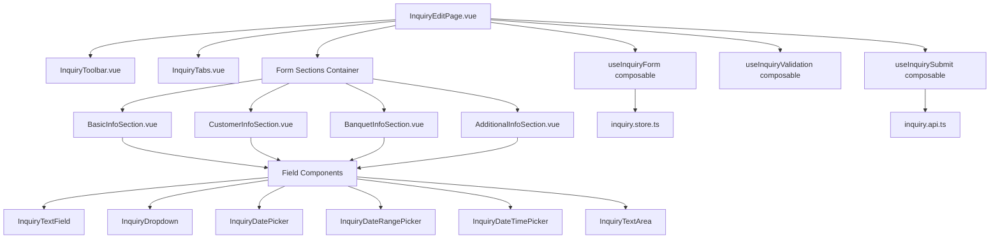

# Design Document

## Overview

本設計文檔描述「初洽單編輯頁面」的技術架構與實作設計。此頁面採用 **Feature-based 架構**，整合 **Syncfusion Vue** 元件庫，遵循 **Figma MCP 工作流程**，確保 UI 與設計稿 100% 一致。

**核心技術堆疊：**
- **Framework**: Nuxt 4 + Vue 3 Composition API
- **UI Library**: Syncfusion EJ2 Vue Components
- **State Management**: Pinia
- **Styling**: Tailwind CSS v4 (僅用於 layout，不覆蓋 Syncfusion 樣式)
- **Validation**: VeeValidate (選用) 或自定義驗證
- **Testing**: Playwright MCP (視覺回歸測試)

## Steering Document Alignment

### Technical Standards (tech.md)

**遵循的技術標準：**

1. **TypeScript 5.9+**：全面型別安全
   - 所有元件使用 `<script setup lang="ts">`
   - 定義完整的 interface/type for props, emits, data models

2. **Syncfusion Vue 元件整合**：
   - 使用 `@syncfusion/ej2-vue-*` 官方套件
   - 遵循 Syncfusion Material 3 主題系統
   - 自定義樣式僅用於 spacing/layout，不改變元件外觀

3. **Nuxt 4 Auto-imports**：
   - Composables 自動導入
   - Pinia stores 自動註冊
   - Vue 3 Composition API (`ref`, `computed`, `watch`) 自動可用

4. **Feature-based 架構**：
   - 所有程式碼集中在 `app/features/inquiry/`
   - 遵循 Single Responsibility Principle
   - 元件高內聚、低耦合

### Project Structure (structure.md)

**目錄結構設計：**

```
app/features/inquiry/
├── pages/
│   └── InquiryEditPage.vue              # 主頁面元件
├── components/
│   ├── InquiryToolbar.vue               # 工具列 (轉訂席單、取消、儲存)
│   ├── InquiryTabs.vue                  # 頁籤導航
│   ├── sections/
│   │   ├── BasicInfoSection.vue         # 基本資料區塊
│   │   ├── CustomerInfoSection.vue      # 客戶資料區塊
│   │   ├── BanquetInfoSection.vue       # 宴會資料區塊
│   │   └── AdditionalInfoSection.vue    # 輔助資訊區塊
│   └── fields/
│       ├── InquiryTextField.vue         # TextBox wrapper
│       ├── InquiryDropdown.vue          # DropDownList wrapper
│       ├── InquiryDatePicker.vue        # DatePicker wrapper
│       ├── InquiryDateRangePicker.vue   # DateRangePicker wrapper
│       ├── InquiryDateTimePicker.vue    # DateTimePicker wrapper
│       └── InquiryTextArea.vue          # TextArea wrapper
├── composables/
│   ├── useInquiryForm.ts                # 表單狀態管理
│   ├── useInquiryValidation.ts          # 表單驗證邏輯
│   └── useInquirySubmit.ts              # 表單提交邏輯
├── store/
│   └── inquiry.store.ts                 # Pinia store
├── api/
│   └── inquiry.api.ts                   # API 呼叫
├── types/
│   └── inquiry.types.ts                 # TypeScript 型別定義
└── index.ts                             # Barrel exports
```

**路由設置：**
```
app/pages/inquiry/edit.vue  →  /inquiry/edit
```

## Code Reuse Analysis

### Existing Components to Leverage

**Syncfusion Vue 元件 (100% 使用)**：

1. **@syncfusion/ej2-vue-buttons**
   - `ButtonComponent` for 轉訂席單、取消、儲存按鈕
   - CSS classes: `e-primary`, `e-danger`, custom border styles

2. **@syncfusion/ej2-vue-navigations**
   - `TabComponent` for 主檔/預計活動明細 tabs

3. **@syncfusion/ej2-vue-inputs**
   - 原生 `<input class="e-input">` for TextBox
   - `TextAreaComponent` for 接洽紀錄

4. **@syncfusion/ej2-vue-dropdowns**
   - `DropDownListComponent` for 單選下拉
   - 需要支援 MultiSelect 時使用 `MultiSelectComponent`

5. **@syncfusion/ej2-vue-calendars**
   - `DatePickerComponent` for 初洽日
   - `DateRangePickerComponent` for 預計宴客日期區間
   - `DateTimePickerComponent` for 預約賞廳日期時間

### Integration Points

**Shared Components (若需要)**：
- `app/shared/components/` 目前無可重用元件，inquiry 功能為獨立模組

**Shared Utilities**：
- `app/shared/utils/` 可能需要：
  - `formatDate(date: Date, format: string)` - 日期格式化
  - `validateEmail(email: string)` - Email 驗證
  - `validatePhone(phone: string)` - 電話號碼驗證

**API Integration**：
- 使用 Nuxt 的 `$fetch` 或 `useFetch` composable
- API endpoint: `/api/inquiry/:id`
  - GET: 取得初洽單資料
  - PUT: 更新初洽單
  - POST: 建立新初洽單

## Architecture

### 系統架構圖



### Modular Design Principles

1. **Single File Responsibility**：
   - `InquiryEditPage.vue`: 僅負責頁面組合與路由
   - `BasicInfoSection.vue`: 僅負責基本資料區塊 UI
   - `useInquiryForm.ts`: 僅負責表單狀態管理

2. **Component Isolation**：
   - 每個 Section 元件可獨立測試
   - Field wrapper 元件封裝 Syncfusion 元件，統一 props interface

3. **Service Layer Separation**：
   - `inquiry.api.ts`: 資料存取層
   - `useInquiryForm.ts`: 業務邏輯層
   - `InquiryEditPage.vue`: 展示層

4. **Utility Modularity**：
   - 驗證邏輯獨立為 `useInquiryValidation.ts`
   - 提交邏輯獨立為 `useInquirySubmit.ts`

## Components and Interfaces

### InquiryEditPage.vue

**Purpose:** 初洽單編輯主頁面，組合所有子元件

**Interfaces:**
```typescript
// Props (從路由參數獲取)
interface Props {
  id?: string  // 編輯模式：初洽單 ID，新增模式：undefined
}

// Composables
const { formData, isModified } = useInquiryForm(props.id)
const { validate, errors } = useInquiryValidation()
const { submit, cancel, convertToOrder } = useInquirySubmit()
```

**Dependencies:**
- InquiryToolbar, InquiryTabs, Section components
- Composables: useInquiryForm, useInquiryValidation, useInquirySubmit

### InquiryToolbar.vue

**Purpose:** 頂部工具列，包含三個操作按鈕

**Interfaces:**
```typescript
interface Props {
  canConvert: boolean    // 轉訂席單按鈕是否可用
  isModified: boolean    // 表單是否已修改
}

interface Emits {
  (e: 'convert'): void   // 轉訂席單
  (e: 'cancel'): void    // 取消
  (e: 'save'): void      // 儲存
}
```

**Syncfusion Usage:**
```vue
<ejs-button cssClass="e-primary" @click="$emit('save')">儲存</ejs-button>
<ejs-button cssClass="e-danger-outline" @click="$emit('cancel')">取消</ejs-button>
```

### BasicInfoSection.vue

**Purpose:** 基本資料區塊，包含 8 個欄位

**Interfaces:**
```typescript
interface Props {
  modelValue: BasicInfo
  errors?: Record<string, string>
}

interface BasicInfo {
  inquiryNo: string           // 初洽單號 (readonly)
  status: string              // 初洽狀態 (required)
  inquiryDate: Date           // 初洽日 (required)
  salesperson: string         // 初洽業務 (required)
  project?: string            // 初洽配合專案
  orderNo?: string            // 訂席單號 (readonly)
  manualNo?: string           // 人工單號
  source?: string             // 初洽訂席來源
}

interface Emits {
  (e: 'update:modelValue', value: BasicInfo): void
  (e: 'navigate-to-order', orderNo: string): void
}
```

**Dependencies:**
- Field components: InquiryTextField, InquiryDropdown, InquiryDatePicker

### InquiryDropdown.vue (Wrapper Component)

**Purpose:** Syncfusion DropDownList 的 wrapper，統一 props interface

**Interfaces:**
```typescript
interface Props {
  modelValue: string | null
  dataSource: Array<{ text: string; value: string }>
  placeholder?: string
  required?: boolean
  disabled?: boolean
  floatLabelType?: 'Auto' | 'Always' | 'Never'
  errorMessage?: string
}

interface Emits {
  (e: 'update:modelValue', value: string | null): void
  (e: 'change', value: string | null): void
}
```

**Syncfusion Usage:**
```vue
<ejs-dropdownlist
  :value="modelValue"
  :dataSource="dataSource"
  :fields="{ text: 'text', value: 'value' }"
  :placeholder="placeholder"
  :enabled="!disabled"
  :floatLabelType="floatLabelType"
  @change="handleChange"
/>
```

## Data Models

### InquiryFormData

```typescript
interface InquiryFormData {
  // 基本資料
  basicInfo: {
    inquiryNo: string           // 初洽單號 (系統產生, YYYYMMDDXXX)
    status: InquiryStatus       // 初洽狀態 (A:待到店, B:已到店, C:已下訂等)
    inquiryDate: Date           // 初洽日
    salesperson: string         // 初洽業務 (代碼:姓名)
    project?: string            // 初洽配合專案
    orderNo?: string            // 訂席單號
    manualNo?: string           // 人工單號
    source?: string             // 初洽訂席來源
  }

  // 客戶資料
  customerInfo: {
    customerId: string          // 客戶 ID
    customerName: string        // 客戶姓名 (必填)
    contactPerson: string       // 聯絡人 (必填, 唯讀)
    contactPhone: {             // 聯絡手機 (必填)
      countryCode: string       // 國碼 (e.g., "+886")
      number: string            // 電話號碼
    }
    contactEmail: string        // 聯絡信箱 (必填)
    address: {                  // 居住地
      city: string              // 縣市
      district: string          // 行政區
    }
  }

  // 宴會資料
  banquetInfo: {
    category: string            // 類別 (必填, 01:婚宴, 02:尾牙等)
    banquetName: string         // 宴會名稱 (必填)
    budgetRange?: string        // 預算範圍 (格式: 50,000–100,000)
    tourSalesperson?: string    // 賞廳業務
    expectedDateRange?: {       // 預計宴客日期區間
      startDate: Date
      endDate: Date
    }
    tourDateTime?: Date         // 預約賞廳日期時間
  }

  // 輔助資訊
  additionalInfo: {
    competitorVenues?: string[] // 已看同業場館 (多選)
    decisionFactors?: string[]  // 決定宴客場地主因 (多選)
    bookedCompetitor?: string   // 下訂同業場館
    notBookedReasons?: string[] // 未下定原因 (多選)
    notes?: string              // 接洽紀錄 (多行文字)
  }
}

// 初洽狀態枚舉
enum InquiryStatus {
  WAITING_VISIT = 'A',      // A:待到店
  VISITED = 'B',            // B:已到店
  ORDERED = 'C',            // C:已下訂
  CANCELLED = 'D'           // D:已取消
}
```

### DropdownOption

```typescript
interface DropdownOption {
  text: string    // 顯示文字 (e.g., "S01:顏平")
  value: string   // 值 (e.g., "S01")
}
```

### ValidationError

```typescript
interface ValidationError {
  field: string       // 欄位名稱 (e.g., "basicInfo.status")
  message: string     // 錯誤訊息 (e.g., "初洽狀態為必填")
}
```

## Error Handling

### Error Scenarios

1. **必填欄位驗證失敗**
   - **Handling:** 在欄位下方顯示紅色錯誤訊息，阻止表單提交
   - **User Impact:** 使用者看到「此欄位為必填」錯誤文字（紅色 #f4493e）

2. **Email 格式錯誤**
   - **Handling:** 使用正則表達式驗證，即時顯示錯誤
   - **User Impact:** 使用者看到「請輸入有效的 Email 格式」

3. **日期區間錯誤（結束日期早於開始日期）**
   - **Handling:** 在 DateRangePicker 的 change 事件中驗證
   - **User Impact:** 使用者看到「結束日期不得早於開始日期」

4. **API 儲存失敗**
   - **Handling:** 顯示 Toast 錯誤訊息，允許使用者重試
   - **User Impact:** 使用者看到「儲存失敗，請稍後再試」，儲存按鈕仍可點擊

5. **網路連線失敗**
   - **Handling:** 顯示 Toast 錯誤訊息，提示檢查網路連線
   - **User Impact:** 使用者看到「網路連線失敗，請檢查您的網路設定」

6. **客戶選擇器開啟失敗**
   - **Handling:** 顯示錯誤 Toast，記錄 console.error
   - **User Impact:** 使用者看到「無法開啟客戶選擇器」

### Error Display Pattern

所有錯誤訊息統一使用以下樣式：
- 位置：欄位下方
- 顏色：#f4493e (Danger color)
- 字體：Roboto Regular 12px
- 行高：16px

```vue
<div v-if="error" class="error-message">
  {{ error }}
</div>

<style scoped>
.error-message {
  color: #f4493e;
  font-size: 12px;
  font-family: 'Roboto', sans-serif;
  line-height: 16px;
  margin-top: 4px;
}
</style>
```

## Testing Strategy

### Unit Testing

**使用 Vitest (未來整合)**：

1. **Composables Testing**：
   - `useInquiryForm.ts`: 測試表單狀態初始化、更新、重置
   - `useInquiryValidation.ts`: 測試各種驗證規則（必填、Email、日期區間）
   - `useInquirySubmit.ts`: 測試提交邏輯、錯誤處理

2. **Field Components Testing**：
   - `InquiryDropdown.vue`: 測試 props 傳遞、事件觸發
   - `InquiryDatePicker.vue`: 測試日期選擇、格式化

3. **API Layer Testing**：
   - `inquiry.api.ts`: Mock API 呼叫，測試錯誤處理

### Integration Testing

**使用 @vue/test-utils + Vitest**：

1. **Section Components Testing**：
   - `BasicInfoSection.vue`: 測試所有欄位的資料綁定與驗證
   - `CustomerInfoSection.vue`: 測試客戶選擇器整合、手機號碼組合
   - `BanquetInfoSection.vue`: 測試日期區間選擇邏輯

2. **Page Component Testing**：
   - `InquiryEditPage.vue`: 測試頁面完整流程（載入 → 編輯 → 儲存）

### End-to-End Testing (Playwright MCP)

**必須執行的視覺回歸測試**：

1. **UI 與 Figma 一致性測試**：
   - 擷取整頁截圖，與 Figma 設計稿比對
   - 驗證 spacing、color、font-size、border-radius 等視覺元素

2. **使用者流程測試**：
   - **Scenario 1**: 新增初洽單
     1. 填寫所有必填欄位
     2. 點擊「儲存」
     3. 驗證成功訊息

   - **Scenario 2**: 編輯既有初洽單
     1. 載入初洽單資料
     2. 修改欄位
     3. 點擊「儲存」
     4. 驗證更新成功

   - **Scenario 3**: 表單驗證
     1. 不填寫必填欄位
     2. 點擊「儲存」
     3. 驗證錯誤訊息顯示

   - **Scenario 4**: 取消編輯
     1. 修改欄位
     2. 點擊「取消」
     3. 驗證返回上一頁且未儲存

3. **Playwright MCP 整合**：
   - 使用 `mcp__playwright__browser_navigate` 開啟頁面
   - 使用 `mcp__playwright__browser_snapshot` 擷取頁面結構
   - 使用 `mcp__playwright__browser_take_screenshot` 擷取截圖
   - 與 Figma `mcp__figma-dev-mode__get_screenshot` 比對

## Implementation Notes

### Syncfusion Theme Customization

**遵循 tech.md 中的主題衝突解決方案**：

1. **Material 3 主題優先順序**：
   ```vue
   <!-- InquiryEditPage.vue -->
   <style scoped>
   /* 確保 Syncfusion Material 3 主題優先 */
   @import "@syncfusion/ej2-vue-calendars/styles/material3.css";
   @import "@syncfusion/ej2-vue-dropdowns/styles/material3.css";
   @import "@syncfusion/ej2-vue-inputs/styles/material3.css";
   @import "@syncfusion/ej2-vue-buttons/styles/material3.css";
   @import "@syncfusion/ej2-vue-navigations/styles/material3.css";

   /* Tailwind 僅用於 layout */
   </style>
   ```

2. **Color Variables 對應**：
   - Figma `$primary: #2877ee` → Syncfusion Material 3 primary color
   - Figma `$danger: #f4493e` → Syncfusion Material 3 error color
   - Figma `$surface-variant: #e5eaf3` → Syncfusion Material 3 surface-variant

3. **不覆蓋 Syncfusion 元件樣式**：
   - 避免使用 Tailwind utility classes 覆蓋 Syncfusion 元件
   - 僅使用 Tailwind 處理 container、grid、spacing

### Performance Optimization

1. **Lazy Loading**：
   - Section components 使用 `defineAsyncComponent`
   - 減少初始 bundle 大小

2. **Debounce Input**：
   - TextBox 輸入使用 300ms debounce
   - 避免頻繁觸發驗證

3. **Memoization**：
   - Dropdown dataSource 使用 `computed` 快取
   - 避免重複轉換資料

### Accessibility (a11y)

1. **ARIA Labels**：
   - 所有 input 欄位設定 `aria-label`
   - Required 欄位設定 `aria-required="true"`

2. **Keyboard Navigation**：
   - Tab 鍵順序遵循表單順序
   - Enter 鍵提交表單（focus 在 save button）

3. **Error Announcement**：
   - 驗證錯誤時設定 `aria-invalid="true"`
   - 錯誤訊息使用 `aria-describedby` 連結到 input
