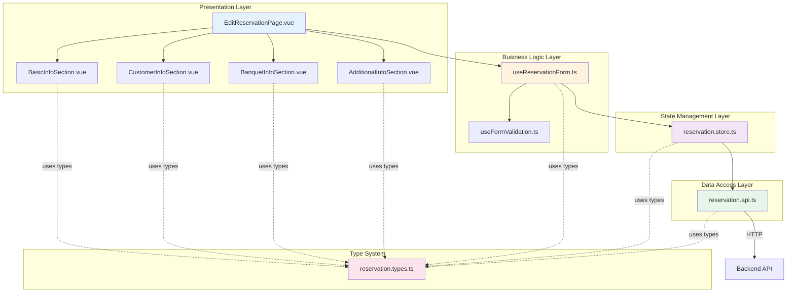

# Design Document

## Overview

本設計文件定義「訂席系統 - 初洽單編輯模式」的技術架構與實作細節。此功能採用 Nuxt 4 + Vue 3 Composition API + Pinia + Syncfusion Vue 元件，遵循專案的 Feature-based 架構模式，確保模組化、可測試性與可維護性。

**核心設計原則**：
1. **Figma 設計優先**：UI 元件 100% 對應 Figma 設計稿（Node ID: 6194:206567）
2. **Syncfusion 元件優先**：優先使用 Syncfusion Vue 元件庫（已安裝 v30.0.0）
3. **Feature-based 模組化**：所有代碼組織於 `app/features/reservation/`
4. **TypeScript 型別安全**：完整的 interface 定義與型別檢查
5. **單一職責原則**：每個檔案只處理一個明確的職責

**技術棧**：
- **Frontend Framework**: Nuxt 4.2 + Vue 3.5 (Composition API)
- **State Management**: Pinia 3.0
- **UI Components**: Syncfusion EJ2 Vue v30.0.0
- **Styling**: Tailwind CSS v4.0 + Syncfusion Material 3 Theme
- **Type System**: TypeScript 5.9
- **Testing**: Playwright MCP（視覺回歸測試）

## Steering Document Alignment

### Technical Standards (tech.md)

**1. 遵循 Feature-based 架構** (tech.md:66-95)
```
app/features/reservation/
├── pages/EditReservationPage.vue      # 頁面元件
├── components/                         # Feature 專屬元件
│   ├── BasicInfoSection.vue
│   ├── CustomerInfoSection.vue
│   ├── BanquetInfoSection.vue
│   └── AdditionalInfoSection.vue
├── composables/                        # 業務邏輯
│   ├── useReservationForm.ts
│   └── useFormValidation.ts
├── store/reservation.store.ts          # 狀態管理
├── api/reservation.api.ts              # API 呼叫
├── types/reservation.types.ts          # 型別定義
└── index.ts                            # Barrel exports
```

**2. 使用 Pinia 作為狀態管理** (tech.md:404-413)
- 採用 Options API 風格（與 auth.store.ts 一致）
- 包含 `state`, `actions`, `getters`
- 型別安全的 store 定義

**3. 整合 Syncfusion Material 3 Theme** (tech.md:32-34)
- 使用已配置的 Syncfusion Material 3 主題
- 確保 Syncfusion 樣式不覆蓋 Tailwind 設定
- 使用 `cssClass` prop 添加 Tailwind utilities

**4. PWA 與效能優化** (tech.md:44-49)
- Syncfusion 元件按需載入（tree-shaking）
- 使用 Nuxt 自動導入機制

### Project Structure (structure.md)

**1. Single Responsibility Principle** (structure.md:660-680)
- ✅ **頁面元件**（`EditReservationPage.vue`）：只負責組合子元件與路由整合，不包含業務邏輯
- ✅ **表單區塊元件**（`BasicInfoSection.vue` 等）：只負責該區塊的 UI 渲染與資料綁定
- ✅ **Composables**（`useReservationForm.ts`）：只負責表單狀態管理與驗證邏輯
- ✅ **Store**（`reservation.store.ts`）：只負責全域狀態管理與 API 呼叫協調
- ✅ **API 模組**（`reservation.api.ts`）：只負責 HTTP 請求封裝

**2. Figma 元件放置規則** (structure.md:1042-1167)
- **Feature 專屬元件**（BasicInfoSection、CustomerInfoSection 等）→ `app/features/reservation/components/`
- **如果未來需要跨 feature 重用 Syncfusion 封裝元件** → 移至 `app/shared/components/`
- **頁面元件**（EditReservationPage）→ `app/features/reservation/pages/`

**3. Import 順序規範** (structure.md:290-323)
```typescript
// 1. External dependencies (npm 套件)
import { defineStore } from 'pinia'
import { ref, computed } from 'vue'

// 2. Syncfusion components
import { TextBoxComponent } from '@syncfusion/ej2-vue-inputs'

// 3. Internal imports (專案內部)
import type { ReservationFormData } from '../types/reservation.types'
import { reservationApi } from '../api/reservation.api'

// 4. Type imports
import type { Component } from 'vue'
```

**4. Barrel Exports 模式** (structure.md:245-270)
```typescript
// app/features/reservation/index.ts
export { useReservationForm } from './composables/useReservationForm'
export { useReservationStore } from './store/reservation.store'
export { reservationApi } from './api/reservation.api'
export type * from './types/reservation.types'
export { default as EditReservationPage } from './pages/EditReservationPage.vue'
```

## Code Reuse Analysis

### Existing Components to Leverage

**從 auth feature 複用的架構模式**：

1. **Store 架構模式** (`app/features/auth/store/auth.store.ts`)
   - ✅ Pinia Options API 風格
   - ✅ `isLoading` 狀態管理模式
   - ✅ Try-catch 錯誤處理模式
   - ✅ Actions 中整合 API 呼叫
   ```typescript
   // 複用模式範例
   actions: {
     async saveReservation(data: ReservationFormData) {
       this.isLoading = true
       try {
         await reservationApi.save(data)
         // Success handling
       } catch (error) {
         console.error('Save failed:', error)
         throw error
       } finally {
         this.isLoading = false
       }
     }
   }
   ```

2. **Types 定義模式** (`app/features/auth/types/auth.types.ts`)
   - ✅ 清晰的 interface 定義
   - ✅ State interface 單獨定義
   - ✅ Request/Response 型別分離

3. **Barrel Exports 模式** (`app/features/auth/index.ts`)
   - ✅ 統一的匯出點
   - ✅ Type-only exports 使用 `export type *`

### Integration Points

**1. Auth Feature 整合**（未來擴展）
- **權限驗證**：透過 `useAuthStore` 檢查使用者是否具備「編輯初洽單」權限
- **使用者資訊**：從 `useAuthStore().user` 獲取當前業務人員資訊（初洽業務欄位預設值）

**2. Router 整合**
- **頁面路由**：在 `app/pages/` 建立路由檔案，導入 `EditReservationPage`
- **動態路由**：`/reservations/:id/edit`（編輯現有初洽單）或 `/reservations/new`（建立新初洽單）
- **導航守衛**：未來可整合權限檢查

**3. API 整合**（後端 API 設計待定）
- **Base URL**: 未來需整合 `app/shared/services/api-client.ts`（目前專案尚未建立）
- **API Endpoints**（預期）:
  ```typescript
  GET    /api/reservations/:id           // 獲取初洽單資料
  POST   /api/reservations                // 建立新初洽單
  PUT    /api/reservations/:id           // 更新初洽單
  DELETE /api/reservations/:id           // 刪除初洽單
  ```

**4. Shared Utilities**（未來建立）
- **表單驗證工具**：`app/shared/composables/useFormValidation.ts`（檢查必填欄位、格式驗證）
- **Toast 通知工具**：`app/shared/composables/useToast.ts`（儲存成功/失敗提示）
- **確認對話框工具**：`app/shared/composables/useConfirm.ts`（取消操作確認）

### What Will Be Created (New Code)

**完全新建的模組**（reservoir feature 目前為空）：
- ✅ 所有 `app/features/reservation/` 目錄下的檔案
- ✅ Syncfusion 元件封裝（如果需要）
- ✅ 初洽單專屬的型別定義與業務邏輯

## Architecture

### Modular Design Principles

**1. Single File Responsibility**
- **頁面元件**（`EditReservationPage.vue`）：僅負責佈局與子元件組合，不包含表單邏輯
- **區塊元件**（`BasicInfoSection.vue` 等）：僅負責渲染該區塊的表單欄位，透過 `v-model` 與父元件同步
- **Composables**（`useReservationForm.ts`）：封裝表單狀態、驗證邏輯、儲存/取消操作
- **Store**（`reservation.store.ts`）：集中管理初洽單資料、loading 狀態、API 呼叫
- **API 模組**（`reservation.api.ts`）：封裝所有 HTTP 請求，返回型別化的 Response

**2. Component Isolation**
- 所有表單區塊元件（`BasicInfoSection`、`CustomerInfoSection` 等）彼此獨立
- 透過 Props 接收資料（`modelValue`），透過 `emit('update:modelValue')` 回傳變更
- 不直接存取 Pinia store，所有資料由父元件（`EditReservationPage`）統一管理

**3. Service Layer Separation**
```
Presentation Layer (Vue Components)
        ↓
Business Logic Layer (Composables)
        ↓
State Management Layer (Pinia Store)
        ↓
Data Access Layer (API Module)
        ↓
Backend API
```

**4. Utility Modularity**
- 表單驗證邏輯獨立為 `useFormValidation.ts`
- Syncfusion 元件配置獨立為各區塊元件內部的 setup functions
- 日期格式化、選項轉換等工具函式集中於 `app/shared/utils/` (未來建立)

### Architecture Diagram



### Data Flow

**儲存流程（Save Flow）**:
```
1. User clicks "儲存" button
2. EditReservationPage.vue → calls useReservationForm().saveForm()
3. useReservationForm → validates form data (useFormValidation)
4. useReservationForm → calls reservationStore.saveReservation(data)
5. reservation.store.ts → calls reservationApi.save(data)
6. reservation.api.ts → sends HTTP PUT/POST to backend
7. Backend response → returns to store → updates state
8. Store → emits success event → composable shows toast notification
9. Page → navigates to list view or shows success message
```

**取消流程（Cancel Flow）**:
```
1. User clicks "取消" button
2. EditReservationPage.vue → calls useReservationForm().cancelForm()
3. useReservationForm → checks if form has unsaved changes (isDirty)
4. If dirty → shows confirm dialog ("您有未儲存的變更，確定要離開嗎？")
5. If user confirms → router.back() or navigateTo('/reservations')
6. If user cancels → stay on current page
```

**載入流程（Load Flow）**:
```
1. Page mounted → onMounted hook
2. Get reservation ID from route params (useRoute().params.id)
3. If ID exists → calls reservationStore.loadReservation(id)
4. reservation.store.ts → calls reservationApi.get(id)
5. API returns data → store updates state
6. Composable watches store state → updates form data (reactive)
7. Form sections automatically update via v-model bindings
```

## Components and Interfaces

### Component Hierarchy

```
EditReservationPage.vue (Main Page)
├── Toolbar Section
│   ├── EjsButton (轉訂席單) - Syncfusion Button
│   ├── EjsButton (取消) - Syncfusion Button
│   └── EjsButton (儲存) - Syncfusion Button
├── EjsTab (Tabs Navigation) - Syncfusion Tab
│   ├── Tab Item: 主檔
│   └── Tab Item: 預計活動明細
└── Form Container
    ├── BasicInfoSection.vue
    │   ├── TextBoxComponent (初洽單號) - Disabled
    │   ├── DropDownListComponent (初洽狀態) - Required
    │   ├── DatePickerComponent (初洽日) - Required
    │   ├── DropDownListComponent (初洽業務) - Required
    │   ├── DropDownListComponent (初洽配合專案)
    │   ├── TextBoxComponent (訂席單號) - Disabled
    │   ├── ButtonComponent (箭頭按鈕)
    │   └── [其他兩個欄位待確認]
    ├── CustomerInfoSection.vue
    │   ├── TextBoxComponent + ButtonComponent (客戶搜尋)
    │   ├── TextBoxComponent (客戶姓名)
    │   ├── DropDownListComponent + TextBoxComponent (電話)
    │   ├── TextBoxComponent (Email/地址)
    │   └── DropDownListComponent x2 (縣市 + 區域)
    ├── BanquetInfoSection.vue
    │   ├── DropDownListComponent (宴會類型)
    │   ├── TextBoxComponent (預計桌數)
    │   ├── TextBoxComponent (預計人數)
    │   ├── DropDownListComponent (時段/場地)
    │   ├── DateRangePickerComponent (宴會日期範圍)
    │   └── DateTimePickerComponent (宴會時間)
    └── AdditionalInfoSection.vue
        ├── DropDownListComponent x4 (輔助資訊)
        └── TextAreaComponent (備註)
```

### Component 1: EditReservationPage.vue

**Purpose**: 主頁面元件，負責組合所有子元件、管理路由整合與整體佈局。

**Interfaces**:
```typescript
// Props (從路由獲取)
interface Props {
  // 透過 useRoute().params.id 獲取，不需要 props
}

// Emits
// 無（頁面元件不需要 emits）

// Public Methods (透過 composable 暴露)
const {
  formData,          // reactive form data
  isLoading,         // loading state
  isDirty,           // has unsaved changes
  saveForm,          // save operation
  cancelForm,        // cancel operation
  errors,            // validation errors
} = useReservationForm()
```

**Dependencies**:
- `useReservationForm()` - 表單邏輯
- `useReservationStore()` - 狀態管理
- `useRoute()` - 路由參數
- `useRouter()` - 路由導航
- Syncfusion: `TabComponent`, `ButtonComponent`

**Reuses**:
- Auth feature 的頁面結構模式
- Nuxt 的檔案式路由機制

**Implementation Notes**:
```vue
<template>
  <div class="reservation-edit-page">
    <!-- Toolbar -->
    <div class="toolbar">
      <ejs-button :disabled="true">轉訂席單</ejs-button>
      <div class="toolbar-actions">
        <ejs-button cssClass="e-danger" @click="cancelForm">取消</ejs-button>
        <ejs-button cssClass="e-primary" @click="saveForm" :disabled="isLoading">儲存</ejs-button>
      </div>
    </div>

    <!-- Tabs -->
    <ejs-tab :selectedItem="0">
      <e-tabitems>
        <e-tabitem :header="{ text: '主檔' }" :content="mainTabContent" />
        <e-tabitem :header="{ text: '預計活動明細' }" />
      </e-tabitems>
    </ejs-tab>

    <!-- Form Container -->
    <div class="form-container">
      <BasicInfoSection v-model="formData.basicInfo" :errors="errors.basicInfo" />
      <CustomerInfoSection v-model="formData.customerInfo" :errors="errors.customerInfo" />
      <BanquetInfoSection v-model="formData.banquetInfo" :errors="errors.banquetInfo" />
      <AdditionalInfoSection v-model="formData.additionalInfo" />
    </div>
  </div>
</template>

<script setup lang="ts">
import { onMounted } from 'vue'
import { useRoute } from 'vue-router'
import { useReservationForm } from '../composables/useReservationForm'
import { TabComponent, ButtonComponent } from '@syncfusion/ej2-vue-navigations'
import BasicInfoSection from '../components/BasicInfoSection.vue'
import CustomerInfoSection from '../components/CustomerInfoSection.vue'
import BanquetInfoSection from '../components/BanquetInfoSection.vue'
import AdditionalInfoSection from '../components/AdditionalInfoSection.vue'

const route = useRoute()
const {
  formData,
  isLoading,
  isDirty,
  saveForm,
  cancelForm,
  errors,
  loadReservation,
} = useReservationForm()

onMounted(async () => {
  const reservationId = route.params.id as string
  if (reservationId) {
    await loadReservation(reservationId)
  }
})
</script>
```

### Component 2: BasicInfoSection.vue

**Purpose**: 渲染「基本資料」區塊的所有表單欄位（8 個欄位）。

**Interfaces**:
```typescript
// Props
interface Props {
  modelValue: BasicInfoData  // v-model binding
  errors?: Record<string, string>  // validation errors
}

// Emits
const emit = defineEmits<{
  'update:modelValue': [value: BasicInfoData]
}>()

// Internal reactive state
const localValue = ref<BasicInfoData>({ ...props.modelValue })

// Watch for external changes
watch(() => props.modelValue, (newVal) => {
  localValue.value = { ...newVal }
}, { deep: true })

// Emit changes to parent
watch(localValue, (newVal) => {
  emit('update:modelValue', newVal)
}, { deep: true })
```

**Dependencies**:
- Syncfusion: `TextBoxComponent`, `DropDownListComponent`, `DatePickerComponent`, `ButtonComponent`
- Type: `BasicInfoData` from `reservation.types.ts`

**Reuses**:
- 無（新建元件）

**Implementation Notes**:
```vue
<template>
  <div class="section">
    <div class="section-title">
      <div class="title-bar"></div>
      <h3>基本資料</h3>
    </div>
    <div class="form-grid">
      <!-- 初洽單號 (Disabled) -->
      <div class="form-field">
        <label>初洽單號</label>
        <ejs-textbox
          v-model="localValue.reservationNo"
          :enabled="false"
          cssClass="e-disabled"
        />
      </div>

      <!-- 初洽狀態 (Required) -->
      <div class="form-field">
        <label>初洽狀態 <span class="required">*</span></label>
        <ejs-dropdownlist
          v-model="localValue.status"
          :dataSource="statusOptions"
          :fields="{ text: 'label', value: 'value' }"
          placeholder="請選擇"
        />
        <span v-if="errors?.status" class="error-message">{{ errors.status }}</span>
      </div>

      <!-- 初洽日 (Required) -->
      <div class="form-field">
        <label>初洽日 <span class="required">*</span></label>
        <ejs-datepicker
          v-model="localValue.reservationDate"
          format="yyyy/MM/dd"
          placeholder="選擇日期"
        />
        <span v-if="errors?.reservationDate" class="error-message">{{ errors.reservationDate }}</span>
      </div>

      <!-- 初洽業務 (Required) -->
      <div class="form-field">
        <label>初洽業務 <span class="required">*</span></label>
        <ejs-dropdownlist
          v-model="localValue.salesPerson"
          :dataSource="salesPersonOptions"
          :fields="{ text: 'label', value: 'value' }"
          placeholder="請選擇"
        />
        <span v-if="errors?.salesPerson" class="error-message">{{ errors.salesPerson }}</span>
      </div>

      <!-- 初洽配合專案 -->
      <div class="form-field">
        <label>初洽配合專案</label>
        <ejs-dropdownlist
          v-model="localValue.project"
          :dataSource="projectOptions"
          :fields="{ text: 'label', value: 'value' }"
          placeholder="請選擇"
        />
      </div>

      <!-- 訂席單號 + 箭頭按鈕 -->
      <div class="form-field form-field-with-button">
        <label>訂席單號</label>
        <div class="input-with-button">
          <ejs-textbox
            v-model="localValue.bookingNo"
            :enabled="false"
            cssClass="e-disabled"
          />
          <ejs-button
            iconCss="e-icons e-arrow-right"
            cssClass="e-icon-btn"
            @click="navigateToBooking"
            :disabled="!localValue.bookingNo"
          />
        </div>
      </div>

      <!-- 其他兩個欄位（待確認欄位標籤）-->
      <!-- ... -->
    </div>
  </div>
</template>

<script setup lang="ts">
import { ref, watch } from 'vue'
import { useRouter } from 'vue-router'
import { TextBoxComponent, ButtonComponent } from '@syncfusion/ej2-vue-inputs'
import { DropDownListComponent } from '@syncfusion/ej2-vue-dropdowns'
import { DatePickerComponent } from '@syncfusion/ej2-vue-calendars'
import type { BasicInfoData } from '../types/reservation.types'

const props = defineProps<{
  modelValue: BasicInfoData
  errors?: Record<string, string>
}>()

const emit = defineEmits<{
  'update:modelValue': [value: BasicInfoData]
}>()

const router = useRouter()
const localValue = ref<BasicInfoData>({ ...props.modelValue })

// Options (mock data, 實際需從 API 獲取)
const statusOptions = ref([
  { label: 'A:待到店', value: 'A' },
  // ... more options
])

const salesPersonOptions = ref([
  { label: 'S01:顏平', value: 'S01' },
  // ... more options
])

const projectOptions = ref([
  { label: '001:年度尾牙促銷', value: '001' },
  // ... more options
])

// Sync with parent
watch(() => props.modelValue, (newVal) => {
  localValue.value = { ...newVal }
}, { deep: true })

watch(localValue, (newVal) => {
  emit('update:modelValue', newVal)
}, { deep: true })

// Navigate to booking detail
function navigateToBooking() {
  if (localValue.value.bookingNo) {
    router.push(`/bookings/${localValue.value.bookingNo}/edit`)
  }
}
</script>

<style scoped>
.section {
  border: 1px solid var(--color-outline-variant);
  border-radius: 6px;
  padding: 16px;
}

.section-title {
  display: flex;
  align-items: center;
  gap: 10px;
  margin-bottom: 16px;
}

.title-bar {
  width: 5px;
  height: 21px;
  background-color: var(--accent);
}

.section-title h3 {
  font-size: 14px;
  font-weight: 700;
  color: var(--accent);
}

.form-grid {
  display: flex;
  flex-wrap: wrap;
  gap: 16px;
}

.form-field {
  width: 251px;
}

.form-field label {
  display: block;
  font-size: 12px;
  margin-bottom: 4px;
  color: var(--on-surface-variant);
}

.required {
  color: var(--danger);
}

.error-message {
  display: block;
  font-size: 12px;
  color: var(--danger);
  margin-top: 4px;
}

.input-with-button {
  display: flex;
  gap: 8px;
  align-items: flex-end;
}

.e-icon-btn {
  width: 40px;
  height: 40px;
  min-width: 40px;
}
</style>
```

### Component 3: CustomerInfoSection.vue

**Purpose**: 渲染「客戶資料」區塊（6 個欄位）。

**Interfaces**:
```typescript
interface Props {
  modelValue: CustomerInfoData
  errors?: Record<string, string>
}

const emit = defineEmits<{
  'update:modelValue': [value: CustomerInfoData]
}>()
```

**Dependencies**:
- Syncfusion: `TextBoxComponent`, `DropDownListComponent`, `ButtonComponent`
- Type: `CustomerInfoData`

**Implementation Notes**:
- 客戶搜尋欄位：`TextBoxComponent` + `ButtonComponent`（搜尋圖標）
- 電話欄位：`DropDownListComponent`（區碼）+ `TextBoxComponent`（號碼）
- 縣市區域：雙 `DropDownListComponent`（縣市 + 區域級聯）

### Component 4: BanquetInfoSection.vue

**Purpose**: 渲染「宴會資料」區塊（6 個欄位）。

**Interfaces**:
```typescript
interface Props {
  modelValue: BanquetInfoData
  errors?: Record<string, string>
}

const emit = defineEmits<{
  'update:modelValue': [value: BanquetInfoData]
}>()
```

**Dependencies**:
- Syncfusion: `TextBoxComponent`, `DropDownListComponent`, `DateRangePickerComponent`, `DateTimePickerComponent`
- Type: `BanquetInfoData`

**Implementation Notes**:
- 宴會日期範圍：使用 `DateRangePickerComponent` 選擇起始與結束日期
- 宴會時間：使用 `DateTimePickerComponent` 選擇具體時段

### Component 5: AdditionalInfoSection.vue

**Purpose**: 渲染「輔助資訊」區塊（5 個欄位）。

**Interfaces**:
```typescript
interface Props {
  modelValue: AdditionalInfoData
  errors?: Record<string, string>
}

const emit = defineEmits<{
  'update:modelValue': [value: AdditionalInfoData]
}>()
```

**Dependencies**:
- Syncfusion: `DropDownListComponent`, `TextAreaComponent`
- Type: `AdditionalInfoData`

**Implementation Notes**:
- 備註欄位：使用 `TextAreaComponent`，高度 120px，寬度跨越整行（1051px）
- 無必填欄位驗證

### Composable: useReservationForm.ts

**Purpose**: 封裝表單狀態管理、驗證邏輯、儲存/取消操作。

**Interfaces**:
```typescript
export function useReservationForm() {
  const formData = reactive<ReservationFormData>({
    basicInfo: { ... },
    customerInfo: { ... },
    banquetInfo: { ... },
    additionalInfo: { ... },
  })

  const errors = reactive<ValidationErrors>({})
  const isDirty = ref(false)
  const isLoading = computed(() => reservationStore.isLoading)

  // Methods
  async function loadReservation(id: string): Promise<void>
  async function saveForm(): Promise<void>
  function cancelForm(): void
  function validateForm(): boolean

  return {
    formData,
    errors,
    isDirty,
    isLoading,
    loadReservation,
    saveForm,
    cancelForm,
    validateForm,
  }
}
```

**Dependencies**:
- `useReservationStore()` - 狀態管理
- `useFormValidation()` - 驗證邏輯
- `useRouter()` - 路由導航
- `useToast()` - Toast 通知（未來建立）
- `useConfirm()` - 確認對話框（未來建立）

**Reuses**:
- Auth feature 的 composable 結構模式

### Composable: useFormValidation.ts

**Purpose**: 封裝表單驗證邏輯（必填欄位、格式驗證）。

**Interfaces**:
```typescript
export function useFormValidation() {
  function validateRequired(value: any, fieldName: string): string | null
  function validateEmail(value: string): string | null
  function validatePhone(value: string): string | null
  function validateDate(value: Date | null): string | null
  function validateForm(data: ReservationFormData): ValidationErrors

  return {
    validateRequired,
    validateEmail,
    validatePhone,
    validateDate,
    validateForm,
  }
}
```

**Dependencies**:
- Type: `ValidationErrors`

**Reuses**:
- 無（新建 composable，未來可移至 `app/shared/composables/`）

## Figma → Syncfusion 元件對應表

**關鍵說明**：
1. ✅ **優先使用 Syncfusion 元件**：所有表單欄位優先對應 Syncfusion 元件
2. ⚠️ **實作時需驗證 API**：透過 Syncfusion MCP 查詢確切的 props 與 events
3. 🎨 **Tailwind 整合**：使用 `cssClass` prop 添加 Tailwind utilities（如 `bg-[var(--color)]`）
4. 📦 **Material 3 Theme**：已配置 Syncfusion Material 3 主題，確保樣式一致性

### 1. 基本資料區塊 (BasicInfoSection)

| Figma 元件名稱 | Figma 類型 | Syncfusion 元件 | 套件 | Props 重點 | 備註 |
|--------------|----------|---------------|------|----------|------|
| **初洽單號** | TextBox (Disabled) | `TextBoxComponent` | `@syncfusion/ej2-vue-inputs` | `enabled: false`, `cssClass: "e-disabled"` | 唯讀，灰色背景 |
| **初洽狀態** | Dropdown List | `DropDownListComponent` | `@syncfusion/ej2-vue-dropdowns` | `dataSource`, `fields: { text, value }`, `placeholder` | 必填（*） |
| **初洽日** | Date Picker | `DatePickerComponent` | `@syncfusion/ej2-vue-calendars` | `format: "yyyy/MM/dd"`, `placeholder` | 必填（*） |
| **初洽業務** | Dropdown List | `DropDownListComponent` | `@syncfusion/ej2-vue-dropdowns` | `dataSource`, `fields` | 必填（*） |
| **初洽配合專案** | Dropdown List | `DropDownListComponent` | `@syncfusion/ej2-vue-dropdowns` | `dataSource`, `fields` | 非必填 |
| **訂席單號** | TextBox (Disabled) | `TextBoxComponent` | `@syncfusion/ej2-vue-inputs` | `enabled: false` | 唯讀 |
| **箭頭按鈕** | Icon Button | `ButtonComponent` | `@syncfusion/ej2-vue-buttons` | `iconCss: "e-icons e-arrow-right"`, `cssClass: "e-icon-btn"` | 導航至訂席單 |
| **其他欄位 1** | TextBox | `TextBoxComponent` | `@syncfusion/ej2-vue-inputs` | 待確認 | 欄位標籤待確認 |
| **其他欄位 2** | Dropdown List | `DropDownListComponent` | `@syncfusion/ej2-vue-dropdowns` | 待確認 | 欄位標籤待確認 |

### 2. 客戶資料區塊 (CustomerInfoSection)

| Figma 元件名稱 | Figma 類型 | Syncfusion 元件 | 套件 | Props 重點 | 備註 |
|--------------|----------|---------------|------|----------|------|
| **客戶搜尋/選擇** | TextBox + Icon Button | `TextBoxComponent` + `ButtonComponent` | `@syncfusion/ej2-vue-inputs` + `@syncfusion/ej2-vue-buttons` | TextBox: `placeholder`, Button: `iconCss` | 搜尋圖標按鈕 |
| **客戶姓名** | TextBox | `TextBoxComponent` | `@syncfusion/ej2-vue-inputs` | `placeholder` | - |
| **電話號碼 (區碼)** | Dropdown List | `DropDownListComponent` | `@syncfusion/ej2-vue-dropdowns` | `dataSource` (區碼清單) | 例：02, 03, 04 |
| **電話號碼 (號碼)** | TextBox | `TextBoxComponent` | `@syncfusion/ej2-vue-inputs` | `placeholder`, `maxLength` | 數字驗證 |
| **Email 或地址** | TextBox | `TextBoxComponent` | `@syncfusion/ej2-vue-inputs` | `placeholder` | - |
| **縣市選擇** | Dropdown List | `DropDownListComponent` | `@syncfusion/ej2-vue-dropdowns` | `dataSource` (縣市清單) | 級聯下拉 |
| **區域選擇** | Dropdown List | `DropDownListComponent` | `@syncfusion/ej2-vue-dropdowns` | `dataSource` (根據縣市動態載入) | 級聯下拉 |

### 3. 宴會資料區塊 (BanquetInfoSection)

| Figma 元件名稱 | Figma 類型 | Syncfusion 元件 | 套件 | Props 重點 | 備註 |
|--------------|----------|---------------|------|----------|------|
| **宴會類型** | Dropdown List | `DropDownListComponent` | `@syncfusion/ej2-vue-dropdowns` | `dataSource` (婚宴、尾牙、春酒等) | - |
| **預計桌數** | TextBox (Number) | `TextBoxComponent` | `@syncfusion/ej2-vue-inputs` | `type: "number"`, `min: 0` | 數字輸入 |
| **預計人數** | TextBox (Number) | `TextBoxComponent` | `@syncfusion/ej2-vue-inputs` | `type: "number"`, `min: 0` | 數字輸入 |
| **時段/場地** | Dropdown List | `DropDownListComponent` | `@syncfusion/ej2-vue-dropdowns` | `dataSource` | - |
| **宴會日期範圍** | DateRange Picker | `DateRangePickerComponent` | `@syncfusion/ej2-vue-calendars` | `format: "yyyy/MM/dd"`, `placeholder`, `startDate`, `endDate` | 選擇起始與結束日期 |
| **宴會時間** | Date Time Picker | `DateTimePickerComponent` | `@syncfusion/ej2-vue-calendars` | `format: "yyyy/MM/dd HH:mm"`, `step: 30` (30 分鐘間隔) | 選擇日期 + 時段 |

### 4. 輔助資訊區塊 (AdditionalInfoSection)

| Figma 元件名稱 | Figma 類型 | Syncfusion 元件 | 套件 | Props 重點 | 備註 |
|--------------|----------|---------------|------|----------|------|
| **輔助欄位 1** | Dropdown List | `DropDownListComponent` | `@syncfusion/ej2-vue-dropdowns` | `dataSource` | 欄位標籤待確認 |
| **輔助欄位 2** | Dropdown List | `DropDownListComponent` | `@syncfusion/ej2-vue-dropdowns` | `dataSource` | 欄位標籤待確認 |
| **輔助欄位 3** | Dropdown List | `DropDownListComponent` | `@syncfusion/ej2-vue-dropdowns` | `dataSource` | 欄位標籤待確認 |
| **輔助欄位 4** | Dropdown List | `DropDownListComponent` | `@syncfusion/ej2-vue-dropdowns` | `dataSource` | 欄位標籤待確認 |
| **備註** | Text Area | `TextAreaComponent` | `@syncfusion/ej2-vue-inputs` | `rows: 6`, `placeholder`, `cssClass` (width: 1051px) | 多行文字輸入 |

### 5. Toolbar 與 Tabs

| Figma 元件名稱 | Figma 類型 | Syncfusion 元件 | 套件 | Props 重點 | 備註 |
|--------------|----------|---------------|------|----------|------|
| **轉訂席單按鈕** | Button (Disabled) | `ButtonComponent` | `@syncfusion/ej2-vue-buttons` | `disabled: true`, `cssClass: "e-outline"` | 灰色邊框，預設禁用 |
| **取消按鈕** | Button | `ButtonComponent` | `@syncfusion/ej2-vue-buttons` | `cssClass: "e-danger"` | 紅色邊框 |
| **儲存按鈕** | Button | `ButtonComponent` | `@syncfusion/ej2-vue-buttons` | `cssClass: "e-primary"`, `isPrimary: true` | 藍色主按鈕 |
| **Tabs 導航** | Tabs | `TabComponent` | `@syncfusion/ej2-vue-navigations` | `selectedItem: 0`, `items: [...]` | 主檔（激活）+ 預計活動明細 |

### Syncfusion 元件通用配置

**1. Material 3 Theme 整合**:
```typescript
// 在 nuxt.config.ts 中已配置 Syncfusion CSS
import '@syncfusion/ej2-base/styles/material3.css'
import '@syncfusion/ej2-vue-inputs/styles/material3.css'
import '@syncfusion/ej2-vue-buttons/styles/material3.css'
import '@syncfusion/ej2-vue-dropdowns/styles/material3.css'
import '@syncfusion/ej2-vue-calendars/styles/material3.css'
import '@syncfusion/ej2-vue-navigations/styles/material3.css'
```

**2. Tailwind CSS Variables 整合**:
```typescript
// 使用 cssClass prop 添加 Tailwind utilities
<ejs-textbox
  cssClass="bg-[var(--color-variables/surface-variant)] border-[var(--color-variables/outline)]"
/>
```

**3. v-model 綁定模式**:
```vue
<!-- Option 1: v-model (推薦) -->
<ejs-textbox v-model="formData.name" />

<!-- Option 2: :value + @change -->
<ejs-textbox
  :value="formData.name"
  @change="(e) => formData.name = e.value"
/>
```

**4. 必填欄位視覺標記**:
```vue
<template>
  <div class="form-field">
    <label>
      初洽狀態 <span class="required">*</span>
    </label>
    <ejs-dropdownlist v-model="formData.status" />
    <span v-if="errors.status" class="error-message">{{ errors.status }}</span>
  </div>
</template>

<style scoped>
.required {
  color: var(--color-variables/danger);
}

.error-message {
  color: var(--color-variables/danger);
  font-size: 12px;
}
</style>
```

## Data Models

### ReservationFormData (Master Interface)

```typescript
// app/features/reservation/types/reservation.types.ts

export interface ReservationFormData {
  basicInfo: BasicInfoData
  customerInfo: CustomerInfoData
  banquetInfo: BanquetInfoData
  additionalInfo: AdditionalInfoData
}

export interface BasicInfoData {
  reservationNo: string           // 初洽單號（唯讀，自動產生）
  status: string                   // 初洽狀態（必填）
  reservationDate: Date | null     // 初洽日（必填）
  salesPerson: string              // 初洽業務（必填）
  project?: string                 // 初洽配合專案（選填）
  bookingNo?: string               // 訂席單號（唯讀，關聯欄位）
  // 其他兩個欄位待確認
  field7?: string
  field8?: string
}

export interface CustomerInfoData {
  customerId?: string              // 客戶 ID（如果是現有客戶）
  customerName: string             // 客戶姓名
  phoneAreaCode: string            // 電話區碼（例：02）
  phoneNumber: string              // 電話號碼
  email?: string                   // Email 或地址（待確認欄位用途）
  city?: string                    // 縣市
  district?: string                // 區域
}

export interface BanquetInfoData {
  banquetType: string              // 宴會類型（婚宴、尾牙等）
  estimatedTables: number          // 預計桌數
  estimatedGuests: number          // 預計人數
  session: string                  // 時段/場地
  dateRange: {
    startDate: Date | null
    endDate: Date | null
  }                                // 宴會日期範圍
  dateTime: Date | null            // 宴會時間（日期 + 時段）
}

export interface AdditionalInfoData {
  field1?: string                  // 輔助欄位 1（待確認欄位用途）
  field2?: string                  // 輔助欄位 2
  field3?: string                  // 輔助欄位 3
  field4?: string                  // 輔助欄位 4
  notes?: string                   // 備註（多行文字）
}

// Validation Errors
export interface ValidationErrors {
  basicInfo?: Record<string, string>
  customerInfo?: Record<string, string>
  banquetInfo?: Record<string, string>
  additionalInfo?: Record<string, string>
}

// Store State
export interface ReservationState {
  currentReservation: ReservationFormData | null
  isLoading: boolean
  error: string | null
}

// API Request/Response Types
export interface CreateReservationRequest {
  data: ReservationFormData
}

export interface UpdateReservationRequest {
  id: string
  data: ReservationFormData
}

export interface ReservationResponse {
  id: string
  data: ReservationFormData
  createdAt: string
  updatedAt: string
  createdBy: string
  updatedBy: string
}

// Dropdown Options Types
export interface DropdownOption {
  label: string
  value: string
}

export interface StatusOption extends DropdownOption {
  // 初洽狀態選項（例：A:待到店）
}

export interface SalesPersonOption extends DropdownOption {
  // 業務人員選項（例：S01:顏平）
}

export interface ProjectOption extends DropdownOption {
  // 專案選項（例：001:年度尾牙促銷）
}
```

### Pinia Store State Model

```typescript
// app/features/reservation/store/reservation.store.ts

import { defineStore } from 'pinia'
import type { ReservationState, ReservationFormData, ReservationResponse } from '../types/reservation.types'
import { reservationApi } from '../api/reservation.api'

export const useReservationStore = defineStore('reservation', {
  state: (): ReservationState => ({
    currentReservation: null,
    isLoading: false,
    error: null,
  }),

  getters: {
    hasReservation: (state) => state.currentReservation !== null,
    reservationId: (state) => state.currentReservation?.id,
  },

  actions: {
    async loadReservation(id: string): Promise<void> {
      this.isLoading = true
      this.error = null
      try {
        const response = await reservationApi.get(id)
        this.currentReservation = response.data
      }
      catch (error: any) {
        this.error = error.message || 'Failed to load reservation'
        console.error('Load reservation failed:', error)
        throw error
      }
      finally {
        this.isLoading = false
      }
    },

    async saveReservation(data: ReservationFormData, id?: string): Promise<void> {
      this.isLoading = true
      this.error = null
      try {
        if (id) {
          // Update existing
          await reservationApi.update(id, data)
        }
        else {
          // Create new
          await reservationApi.create(data)
        }
        // Success handling (toast notification handled by composable)
      }
      catch (error: any) {
        this.error = error.message || 'Failed to save reservation'
        console.error('Save reservation failed:', error)
        throw error
      }
      finally {
        this.isLoading = false
      }
    },

    clearReservation(): void {
      this.currentReservation = null
      this.error = null
    },
  },
})
```

### API Module Interfaces

```typescript
// app/features/reservation/api/reservation.api.ts

import type {
  ReservationFormData,
  ReservationResponse,
  CreateReservationRequest,
  UpdateReservationRequest,
} from '../types/reservation.types'

export const reservationApi = {
  /**
   * 獲取初洽單資料
   * @param id 初洽單 ID
   */
  async get(id: string): Promise<ReservationResponse> {
    // TODO: 整合實際 API endpoint
    // const response = await $fetch(`/api/reservations/${id}`)
    // return response

    // Mock implementation
    throw new Error('API not implemented')
  },

  /**
   * 建立新初洽單
   * @param data 表單資料
   */
  async create(data: ReservationFormData): Promise<ReservationResponse> {
    // TODO: 整合實際 API endpoint
    // const response = await $fetch('/api/reservations', {
    //   method: 'POST',
    //   body: { data },
    // })
    // return response

    // Mock implementation
    throw new Error('API not implemented')
  },

  /**
   * 更新初洽單資料
   * @param id 初洽單 ID
   * @param data 表單資料
   */
  async update(id: string, data: ReservationFormData): Promise<ReservationResponse> {
    // TODO: 整合實際 API endpoint
    // const response = await $fetch(`/api/reservations/${id}`, {
    //   method: 'PUT',
    //   body: { data },
    // })
    // return response

    // Mock implementation
    throw new Error('API not implemented')
  },

  /**
   * 刪除初洽單
   * @param id 初洽單 ID
   */
  async delete(id: string): Promise<void> {
    // TODO: 整合實際 API endpoint
    // await $fetch(`/api/reservations/${id}`, {
    //   method: 'DELETE',
    // })

    // Mock implementation
    throw new Error('API not implemented')
  },
}
```

## Error Handling

### Error Scenarios

**1. API 請求失敗**
- **Handling**:
  - Store 的 `actions` 中使用 try-catch 捕獲錯誤
  - 將錯誤訊息儲存至 `state.error`
  - Composable 監聽 `state.error` 並顯示 Toast 通知
- **User Impact**:
  - 顯示友善錯誤訊息：「儲存失敗，請稍後再試」
  - 保留使用者輸入的資料（不清空表單）
  - 提供「重試」按鈕

**2. 表單驗證失敗**
- **Handling**:
  - `useFormValidation` 檢查必填欄位（初洽狀態、初洽日、初洽業務）
  - 返回 `ValidationErrors` 物件，標記錯誤欄位
  - 區塊元件透過 `props.errors` 接收錯誤訊息並顯示
- **User Impact**:
  - 必填欄位未填寫時，顯示紅色邊框 + 錯誤訊息（例：「此欄位為必填」）
  - 焦點自動移至第一個錯誤欄位
  - 阻止表單提交，直到所有驗證通過

**3. 網路斷線**
- **Handling**:
  - Fetch 請求失敗時，捕獲網路錯誤
  - 檢測 `navigator.onLine` 狀態
- **User Impact**:
  - 顯示「網路連線中斷，請檢查網路設定」
  - 「儲存」按鈕禁用（加上 tooltip 提示）

**4. 並發編輯衝突**（樂觀鎖）
- **Handling**:
  - Backend 回傳 409 Conflict 錯誤
  - Store 捕獲錯誤並提示使用者
- **User Impact**:
  - 顯示「此初洽單已被其他使用者修改，請重新載入」
  - 提供「重新載入」按鈕（會覆蓋當前未儲存的變更，需確認）

**5. 權限不足**
- **Handling**:
  - Backend 回傳 403 Forbidden
  - Redirect 至無權限頁面或顯示錯誤訊息
- **User Impact**:
  - 顯示「您沒有權限編輯此初洽單」
  - 所有表單欄位設為唯讀模式

**6. Syncfusion 元件載入失敗**
- **Handling**:
  - Vue 的 `onErrorCaptured` hook 捕獲元件錯誤
  - 顯示降級 UI（使用原生 HTML input 替代）
- **User Impact**:
  - 顯示「元件載入失敗，使用基本模式」
  - 功能可正常使用，但樣式較簡陋

**7. 資料格式錯誤**
- **Handling**:
  - Backend 回傳 400 Bad Request，包含欄位級錯誤訊息
  - 解析 API response，將錯誤對應至對應欄位
- **User Impact**:
  - 錯誤欄位顯示具體錯誤訊息（例：「日期格式不正確」）

### Error Handling Implementation

```typescript
// app/features/reservation/composables/useReservationForm.ts

export function useReservationForm() {
  const router = useRouter()
  const reservationStore = useReservationStore()
  const { validateForm } = useFormValidation()

  const formData = reactive<ReservationFormData>({ ... })
  const errors = reactive<ValidationErrors>({})
  const isDirty = ref(false)

  async function saveForm() {
    // 1. Validate form
    const validationErrors = validateForm(formData)
    if (Object.keys(validationErrors).length > 0) {
      Object.assign(errors, validationErrors)
      // Focus first error field (TODO: implement)
      return
    }

    // 2. Save via store
    try {
      await reservationStore.saveReservation(formData, route.params.id as string)

      // 3. Success handling
      // TODO: Show toast notification
      console.log('Save successful')
      isDirty.value = false

      // 4. Navigate back
      router.push('/reservations')
    }
    catch (error: any) {
      // 4. Error handling
      console.error('Save failed:', error)

      // TODO: Show error toast
      if (error.message.includes('network')) {
        alert('網路連線中斷，請檢查網路設定')
      }
      else if (error.status === 409) {
        alert('此初洽單已被其他使用者修改，請重新載入')
      }
      else {
        alert('儲存失敗，請稍後再試')
      }
    }
  }

  function cancelForm() {
    if (isDirty.value) {
      // TODO: Show confirm dialog
      const confirmed = confirm('您有未儲存的變更，確定要離開嗎？')
      if (!confirmed) return
    }

    router.back()
  }

  return {
    formData,
    errors,
    isDirty,
    isLoading: computed(() => reservationStore.isLoading),
    saveForm,
    cancelForm,
  }
}
```

## Testing Strategy

### Unit Testing

**測試工具**：Vitest（未來整合，tech.md Known Limitations #2）

**測試範圍**：
1. **Composables**:
   - `useReservationForm.ts` - 測試表單狀態管理、儲存/取消邏輯
   - `useFormValidation.ts` - 測試所有驗證規則（必填、格式驗證）

2. **Store**:
   - `reservation.store.ts` - 測試 actions、getters、state mutations
   - Mock API 呼叫，測試成功與失敗情境

3. **API Module**:
   - `reservation.api.ts` - 測試 HTTP 請求封裝
   - Mock `$fetch`，驗證 request 格式與 response 處理

**範例測試**（未來實作）:
```typescript
// app/features/reservation/__tests__/useFormValidation.test.ts

import { describe, it, expect } from 'vitest'
import { useFormValidation } from '../composables/useFormValidation'

describe('useFormValidation', () => {
  const { validateRequired, validateForm } = useFormValidation()

  it('should return error for empty required field', () => {
    const error = validateRequired('', '初洽狀態')
    expect(error).toBe('初洽狀態為必填欄位')
  })

  it('should return null for valid required field', () => {
    const error = validateRequired('A', '初洽狀態')
    expect(error).toBeNull()
  })

  it('should validate entire form', () => {
    const formData = {
      basicInfo: {
        status: '',  // Missing required field
        reservationDate: null,  // Missing required field
        salesPerson: 'S01',  // Valid
      },
      // ...
    }

    const errors = validateForm(formData)
    expect(errors.basicInfo).toHaveProperty('status')
    expect(errors.basicInfo).toHaveProperty('reservationDate')
    expect(errors.basicInfo).not.toHaveProperty('salesPerson')
  })
})
```

### Integration Testing

**測試工具**：Vitest + @vue/test-utils

**測試範圍**：
1. **元件整合測試**:
   - 測試 `BasicInfoSection.vue` 與 `useReservationForm` 的整合
   - 驗證 v-model 雙向綁定正確運作
   - 驗證錯誤訊息正確顯示

2. **Store + API 整合測試**:
   - 測試 `reservation.store.ts` 呼叫 `reservation.api.ts` 的流程
   - Mock backend API responses
   - 驗證 loading 狀態、錯誤處理

**範例測試**（未來實作）:
```typescript
// app/features/reservation/__tests__/BasicInfoSection.integration.test.ts

import { mount } from '@vue/test-utils'
import { describe, it, expect } from 'vitest'
import BasicInfoSection from '../components/BasicInfoSection.vue'

describe('BasicInfoSection Integration', () => {
  it('should emit update:modelValue when field changes', async () => {
    const wrapper = mount(BasicInfoSection, {
      props: {
        modelValue: {
          reservationNo: '20240830001',
          status: '',
          // ...
        },
      },
    })

    // Simulate dropdown selection
    const dropdown = wrapper.findComponent({ name: 'EjsDropdownList' })
    await dropdown.vm.$emit('change', { value: 'A' })

    // Verify emit
    expect(wrapper.emitted('update:modelValue')).toBeTruthy()
    expect(wrapper.emitted('update:modelValue')[0][0].status).toBe('A')
  })

  it('should display error message for invalid field', async () => {
    const wrapper = mount(BasicInfoSection, {
      props: {
        modelValue: { /* ... */ },
        errors: {
          status: '初洽狀態為必填欄位',
        },
      },
    })

    const errorMessage = wrapper.find('.error-message')
    expect(errorMessage.exists()).toBe(true)
    expect(errorMessage.text()).toBe('初洽狀態為必填欄位')
  })
})
```

### End-to-End Testing

**測試工具**：Playwright MCP（視覺回歸測試）

**測試範圍**：
1. **頁面渲染測試**:
   - 驗證所有區塊標題正確顯示（基本資料、客戶資料、宴會資料、輔助資訊）
   - 驗證所有表單欄位可見
   - 驗證必填欄位標記 * 號

2. **表單互動測試**:
   - 測試所有 Syncfusion 元件可正常互動（點擊、輸入、選擇）
   - 測試下拉選單展開與選擇
   - 測試日期選擇器開啟與日期選擇
   - 測試 Tab 切換（主檔 ↔ 預計活動明細）

3. **視覺回歸測試**:
   - 截圖對比測試（與 Figma 設計稿比對）
   - 驗證顏色、字級、間距與 Figma 一致
   - 檢測 UI 元件位置與排版

4. **表單提交流程測試**:
   - 測試儲存成功流程（填寫所有必填欄位 → 點擊儲存 → 驗證 API 呼叫）
   - 測試驗證失敗流程（未填寫必填欄位 → 點擊儲存 → 驗證錯誤訊息顯示）
   - 測試取消流程（修改表單 → 點擊取消 → 驗證確認對話框 → 確認離開）

**範例測試**（使用 Playwright MCP）:
```typescript
// tests/e2e/reservation-edit.spec.ts

import { test, expect } from '@playwright/test'

test.describe('Reservation Edit Page', () => {
  test('should render all form sections', async ({ page }) => {
    await page.goto('/reservations/new')

    // Verify section titles
    await expect(page.locator('text=基本資料')).toBeVisible()
    await expect(page.locator('text=客戶資料')).toBeVisible()
    await expect(page.locator('text=宴會資料')).toBeVisible()
    await expect(page.locator('text=輔助資訊')).toBeVisible()

    // Verify required field markers
    await expect(page.locator('label:has-text("初洽狀態") >> text=*')).toBeVisible()
    await expect(page.locator('label:has-text("初洽日") >> text=*')).toBeVisible()
    await expect(page.locator('label:has-text("初洽業務") >> text=*')).toBeVisible()
  })

  test('should show validation errors for required fields', async ({ page }) => {
    await page.goto('/reservations/new')

    // Click save without filling required fields
    await page.click('button:has-text("儲存")')

    // Verify error messages
    await expect(page.locator('text=初洽狀態為必填欄位')).toBeVisible()
    await expect(page.locator('text=初洽日為必填欄位')).toBeVisible()
    await expect(page.locator('text=初洽業務為必填欄位')).toBeVisible()
  })

  test('should successfully save form with valid data', async ({ page }) => {
    await page.goto('/reservations/new')

    // Fill required fields
    await page.selectOption('text=初洽狀態', { label: 'A:待到店' })
    await page.fill('input[placeholder="選擇日期"]', '2025/08/22')
    await page.selectOption('text=初洽業務', { label: 'S01:顏平' })

    // Click save
    await page.click('button:has-text("儲存")')

    // Verify success (navigate to list or show toast)
    await expect(page).toHaveURL('/reservations')
    // TODO: Verify toast notification
  })

  test('should match Figma design (visual regression)', async ({ page }) => {
    await page.goto('/reservations/new')

    // Take screenshot for visual comparison
    await expect(page).toHaveScreenshot('reservation-edit-page.png', {
      fullPage: true,
      threshold: 0.2,  // 允許 20% 差異
    })
  })
})
```

---

## Implementation Checklist

**Phase 1: 基礎架構建立**
- [ ] 建立 `app/features/reservation/` 目錄結構
- [ ] 定義 TypeScript types (`reservation.types.ts`)
- [ ] 建立 Pinia store (`reservation.store.ts`)
- [ ] 建立 API module (`reservation.api.ts`)
- [ ] 建立 barrel exports (`index.ts`)

**Phase 2: Composables 開發**
- [ ] 實作 `useReservationForm.ts`（表單狀態管理）
- [ ] 實作 `useFormValidation.ts`（驗證邏輯）

**Phase 3: UI 元件開發**
- [ ] 實作 `BasicInfoSection.vue`（基本資料區塊）
- [ ] 實作 `CustomerInfoSection.vue`（客戶資料區塊）
- [ ] 實作 `BanquetInfoSection.vue`（宴會資料區塊）
- [ ] 實作 `AdditionalInfoSection.vue`（輔助資訊區塊）
- [ ] 實作 `EditReservationPage.vue`（主頁面）

**Phase 4: Syncfusion 元件整合**
- [ ] 透過 Syncfusion MCP 驗證所有元件 API
- [ ] 配置 Syncfusion Material 3 Theme
- [ ] 整合 Tailwind CSS 與 Syncfusion 樣式

**Phase 5: 路由與頁面整合**
- [ ] 在 `app/pages/` 建立路由檔案
- [ ] 配置動態路由（`/reservations/:id/edit`, `/reservations/new`）

**Phase 6: 測試**
- [ ] 使用 Playwright MCP 進行視覺回歸測試
- [ ] 驗證所有表單欄位可正常互動
- [ ] 驗證表單驗證邏輯
- [ ] 驗證儲存/取消流程

**Phase 7: 完善與優化**
- [ ] 整合 Auth feature（權限驗證）
- [ ] 建立 Shared utilities（Toast、Confirm 等）
- [ ] 效能優化（Syncfusion 元件懶載入）
- [ ] 錯誤處理完善

---

**實作時需注意**：
1. ⚠️ **Syncfusion API 驗證**：實作前必須透過 Syncfusion MCP 查詢具體 API，不可臆測
2. ⚠️ **Figma 欄位標籤確認**：部分欄位標籤未明確（BasicInfo 的其他兩個欄位、AdditionalInfo 的四個下拉欄位），需與產品團隊確認
3. ⚠️ **Backend API 整合**：目前 API endpoints 為預期設計，實際需與後端團隊對接
4. ⚠️ **Material 3 Theme 衝突**：確保 Syncfusion 樣式不覆蓋 Tailwind 設定（參考專案既有配置）
