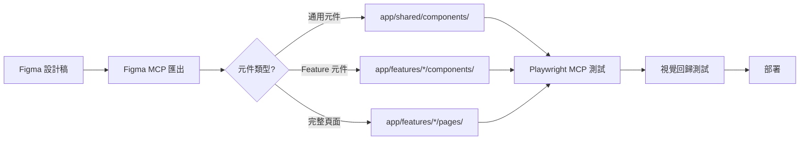

# Project Structure

## Directory Organization

### 完整專案結構

```
nuxt4-tailwind-starter/
├── app/                        # Nuxt 應用主目錄
│   ├── features/              # Feature-based 模組（核心架構）
│   │   ├── auth/              # 認證功能模組
│   │   │   ├── pages/         # Feature 專屬頁面元件
│   │   │   │   └── LoginPage.vue
│   │   │   ├── components/    # Feature 專屬 UI 元件
│   │   │   │   └── LoginForm.vue
│   │   │   ├── composables/   # Feature 專屬組合式 API
│   │   │   │   └── useAuth.ts
│   │   │   ├── store/         # Feature 專屬 Pinia Store
│   │   │   │   └── auth.store.ts
│   │   │   ├── api/           # Feature 專屬 API 呼叫
│   │   │   │   └── auth.api.ts
│   │   │   ├── types/         # Feature 專屬型別定義
│   │   │   │   └── auth.types.ts
│   │   │   ├── __tests__/     # Feature 單元測試
│   │   │   └── index.ts       # Barrel exports（統一匯出點）
│   │   └── members/           # 其他 feature 模組（範例）
│   │       └── ...            # 相同結構
│   │
│   ├── pages/                 # Nuxt 檔案式路由
│   │   ├── index.vue          # 首頁 (/)
│   │   └── login.vue          # 登入頁 (/login)
│   │
│   ├── layouts/               # 頁面版型
│   │   ├── default.vue        # 預設版型
│   │   └── README.md
│   │
│   ├── shared/                # 跨功能共用程式碼
│   │   ├── components/        # 共用 UI 元件（Dumb Components）
│   │   ├── composables/       # 共用組合式 API (useFetch, useModal...)
│   │   ├── services/          # 共用服務 (API client, logger...)
│   │   ├── utils/             # 工具函式 (formatters, validators...)
│   │   └── types/             # 全域型別定義
│   │
│   ├── stores/                # 全域 Pinia stores
│   │   └── index.ts           # Store 入口
│   │
│   ├── config/                # 配置檔案
│   │   └── pwa.ts             # PWA 配置
│   │
│   ├── constants/             # 常數定義
│   │   └── index.ts           # 應用常數 (appName, appDescription...)
│   │
│   ├── assets/                # 靜態資源
│   │   └── css/
│   │       └── tailwind.css   # Tailwind CSS 入口
│   │
│   └── app.vue                # 應用根元件
│
├── server/                    # Nuxt Server API routes（選用）
│   └── api/                   # 伺服器端 API endpoints
│
├── public/                    # 公開靜態資源
│   ├── favicon.ico
│   ├── pwa-192x192.png
│   ├── pwa-512x512.png
│   └── maskable-icon.png
│
├── .spec-workflow/            # Spec Workflow MCP 工作目錄
│   ├── templates/             # 規範模板
│   ├── specs/                 # 功能規範文檔
│   ├── steering/              # 專案指導文檔
│   │   ├── product.md
│   │   ├── tech.md
│   │   └── structure.md
│   └── user-templates/        # 自定義模板
│
├── .nuxt/                     # Nuxt 自動生成（不提交）
├── .output/                   # 建置輸出（不提交）
├── node_modules/              # 依賴（不提交）
│
├── nuxt.config.ts             # Nuxt 配置
├── tailwind.config.ts         # Tailwind CSS 配置
├── tsconfig.json              # TypeScript 配置
├── eslint.config.js           # ESLint 配置
├── package.json               # 專案依賴與腳本
├── yarn.lock                  # Yarn 鎖定檔案
└── README.md                  # 專案說明文檔
```

### Feature-based 架構原則

**核心理念**: 依功能模組組織代碼，而非技術分層。每個 feature 包含該功能的所有相關代碼。

#### Feature 模組結構規範

每個 feature 目錄（如 `app/features/auth/`）必須包含：

1. **pages/**: Feature 專屬頁面元件
   - 實作完整的頁面邏輯
   - 可包含多個頁面（如 LoginPage、RegisterPage）
   - 透過 barrel exports 匯出供 `app/pages/` 使用

2. **components/**: Feature 專屬 UI 元件
   - 只給該 feature 使用的元件
   - 不跨 feature 重用
   - 如需跨 feature 使用，移至 `app/shared/components/`

3. **composables/**: Feature 專屬組合式 API
   - 封裝該 feature 的業務邏輯
   - 狀態管理、副作用處理
   - 例如：useAuth、useLogin

4. **store/**: Feature 專屬 Pinia Store
   - 該 feature 的全域狀態
   - 命名：`[feature].store.ts`
   - 透過 `useXxxStore()` 訪問

5. **api/**: Feature 專屬 API 呼叫
   - 封裝與後端互動的函式
   - 命名：`[feature].api.ts`
   - 例如：authApi.login(), authApi.logout()

6. **types/**: Feature 專屬型別定義
   - TypeScript interfaces、types、enums
   - 命名：`[feature].types.ts`
   - 透過 barrel exports 匯出

7. **__tests__/**: Feature 單元測試
   - 對應的測試檔案
   - 命名：`[filename].test.ts` 或 `[filename].spec.ts`

8. **index.ts**: Barrel exports
   - 統一匯出該 feature 的 public API
   - 外部只透過 index.ts 導入
   - 範例見下方「Barrel Exports 模式」

#### Shared 模組規範

**用途**: 存放可跨 feature 重用的程式碼

- **components/**: 通用 UI 元件（Button、Input、Modal 等）
- **composables/**: 通用組合式 API（useFetch、useDebounce 等）
- **services/**: 應用級服務（API client、logger、analytics 等）
- **utils/**: 純函式工具（formatDate、validateEmail 等）
- **types/**: 全域型別定義（User、Response 等）

**原則**:
- 元件應為 Dumb Components（無業務邏輯）
- 高度可重用性
- 良好的文檔與範例

### Pages 與 Layouts

#### Pages (檔案式路由)

- **位置**: `app/pages/`
- **作用**: 定義應用路由結構
- **原則**:
  - 頁面檔案應極簡，主要邏輯在 feature pages 中
  - 從 features 導入頁面元件並組合
  - 檔案名稱對應路由路徑

**範例**:
```vue
<!-- app/pages/login.vue -->
<script setup lang="ts">
import { LoginPage } from '~/features/auth'
</script>

<template>
  <LoginPage />
</template>
```

**路由對應**:
- `pages/index.vue` → `/`
- `pages/login.vue` → `/login`
- `pages/users/[id].vue` → `/users/:id`（動態路由）
- `pages/users/index.vue` → `/users`

#### Layouts (版型)

- **位置**: `app/layouts/`
- **作用**: 定義頁面共用版型
- **預設**: `default.vue` 為預設版型

**使用方式**:
```vue
<script setup lang="ts">
definePageMeta({
  layout: 'custom' // 使用 layouts/custom.vue
})
</script>
```

## Naming Conventions

### 檔案命名規範

| 檔案類型 | 命名規範 | 範例 |
|---------|---------|------|
| **Vue 元件** | PascalCase | `LoginPage.vue`, `LoginForm.vue`, `UserCard.vue` |
| **Nuxt Pages** | kebab-case | `index.vue`, `login.vue`, `user-profile.vue` |
| **Layouts** | kebab-case | `default.vue`, `admin.vue`, `auth.vue` |
| **Composables** | camelCase | `useAuth.ts`, `useFetch.ts`, `useModal.ts` |
| **Stores** | kebab-case.store.ts | `auth.store.ts`, `user.store.ts` |
| **API 模組** | kebab-case.api.ts | `auth.api.ts`, `members.api.ts` |
| **Types** | kebab-case.types.ts | `auth.types.ts`, `user.types.ts` |
| **Utils** | kebab-case.ts | `date-utils.ts`, `validators.ts` |
| **Services** | kebab-case.ts | `api-client.ts`, `logger.ts` |
| **Config** | kebab-case.ts | `pwa.ts`, `i18n.ts` |
| **Constants** | kebab-case | `index.ts`, `api-endpoints.ts` |
| **Tests** | [filename].test.ts | `useAuth.test.ts`, `LoginPage.test.ts` |

### 程式碼命名規範

#### TypeScript/JavaScript

| 類型 | 命名規範 | 範例 |
|-----|---------|------|
| **Variables** | camelCase | `userName`, `isLoggedIn`, `apiResponse` |
| **Constants** | UPPER_SNAKE_CASE | `API_BASE_URL`, `MAX_RETRY_COUNT` |
| **Functions** | camelCase | `getUserData()`, `validateEmail()` |
| **Classes** | PascalCase | `ApiClient`, `UserService` |
| **Interfaces** | PascalCase | `User`, `ApiResponse`, `AuthState` |
| **Types** | PascalCase | `UserId`, `LoginCredentials` |
| **Enums** | PascalCase | `UserRole`, `ApiStatus` |
| **Enum Members** | PascalCase | `UserRole.Admin`, `ApiStatus.Success` |
| **Composables** | use + PascalCase | `useAuth()`, `useFetch()`, `useModal()` |
| **Store Getters** | PascalCase (function) | `useAuthStore()` |

#### Vue 元件

| 元素 | 命名規範 | 範例 |
|-----|---------|------|
| **Component Props** | camelCase | `userName`, `isActive`, `onClick` |
| **Component Events** | kebab-case | `@user-login`, `@data-updated` |
| **Component Slots** | kebab-case | `<slot name="header">` |
| **Refs** | camelCase + Ref | `userRef`, `formRef`, `modalRef` |
| **Reactive** | camelCase | `state`, `formData`, `filters` |

### 特殊命名規則

#### Barrel Exports (index.ts)
每個 feature 模組必須包含 `index.ts` 作為統一匯出點：

```typescript
// app/features/auth/index.ts

// Export composables
export { useAuth } from './composables/useAuth'

// Export stores
export { useAuthStore } from './store/auth.store'

// Export API
export { authApi } from './api/auth.api'

// Export types (type-only)
export type * from './types/auth.types'

// Export pages
export { default as LoginPage } from './pages/LoginPage.vue'
export { default as RegisterPage } from './pages/RegisterPage.vue'
```

**原則**:
- 外部只透過 barrel exports 導入
- 不直接導入內部檔案
- Type imports 使用 `export type *`

#### Auto-imports 慣例

Nuxt 自動導入以下內容（無需手動 import）：

1. **Composables**:
   - `app/composables/` 目錄下的檔案
   - Vue 官方 composables（`ref`, `computed`, `watch` 等）
   - Nuxt composables（`navigateTo`, `useFetch` 等）

2. **Components**:
   - `app/components/` 目錄下的元件（全域註冊）
   - 使用 `unplugin-vue-components` 自動導入

3. **Utils**:
   - `app/utils/` 目錄下的工具函式

**Feature 模組導入**: 需手動 import（使用 `~/features/auth` 路徑別名）

## Import Patterns

### Import 順序規範

透過 ESLint 強制執行以下順序（eslint.config.js:10-26）：

```typescript
// 1. Node.js 內建模組
import path from 'node:path'
import fs from 'node:fs'

// 2. External dependencies (npm 套件)
import { defineStore } from 'pinia'
import { ref, computed } from 'vue'

// 3. Internal imports (專案內部，使用別名)
import { useAuth } from '~/features/auth'
import { formatDate } from '~/shared/utils'

// 4. Parent directory (../)
import { ParentComponent } from '../components'

// 5. Sibling directory (./)
import { SiblingComponent } from './components'

// 6. Index imports
import utils from './utils'

// 7. Object imports (解構)
import type { User } from './types'

// 8. Type imports (TypeScript 類型)
import type { Component } from 'vue'
```

**配置**: `import/order` rule in `eslint.config.js`

### 路徑別名 (Path Aliases)

Nuxt 自動配置以下別名：

| 別名 | 對應路徑 | 使用場景 |
|-----|---------|---------|
| `~` 或 `@` | `app/` | 從 app 目錄導入 |
| `~~` 或 `@@` | 專案根目錄 | 從根目錄導入 |
| `#app` | Nuxt 內建 | Nuxt 核心功能 |
| `#imports` | Auto-imports | 自動導入的項目 |

**範例**:
```typescript
// 從 features 導入
import { useAuth } from '~/features/auth'

// 從 shared 導入
import { Button } from '~/shared/components'

// 從 config 導入
import { pwa } from '~/config/pwa'

// 從根目錄導入（配置檔）
import { appName } from '~/constants'
```

### Module/Package Organization

#### Feature 模組導入規則

**從外部導入 feature**:
```typescript
// ✅ 正確：透過 barrel exports
import { useAuth, LoginPage } from '~/features/auth'

// ❌ 錯誤：直接導入內部檔案
import { useAuth } from '~/features/auth/composables/useAuth'
```

**Feature 內部導入**:
```typescript
// app/features/auth/store/auth.store.ts

// ✅ 正確：相對路徑導入同 feature 內部模組
import type { LoginCredentials } from '../types/auth.types'
import { authApi } from '../api/auth.api'

// ❌ 錯誤：透過 barrel exports 導入自己
import { authApi } from '~/features/auth'
```

#### Shared 模組導入規則

```typescript
// ✅ 正確：直接導入 shared 模組
import { Button } from '~/shared/components/Button.vue'
import { formatDate } from '~/shared/utils/date-utils'

// ✅ 也可以：如果有 barrel exports
import { Button } from '~/shared/components'
```

### Type Imports

使用 `type` 關鍵字標註純型別導入（優化建置）：

```typescript
// ✅ 推薦：純型別導入
import type { User, ApiResponse } from '~/shared/types'

// ⚠️ 可行但不推薦：混合導入
import { type User, fetchUser } from '~/features/users'

// ✅ 正確：分離型別與值導入
import type { User } from '~/features/users'
import { fetchUser } from '~/features/users'
```

## Code Structure Patterns

### Vue 單檔元件結構

**標準順序**:
```vue
<!-- 1. Script 區塊（優先） -->
<script setup lang="ts">
// 1.1 Imports
import { ref, computed } from 'vue'
import type { User } from '~/shared/types'

// 1.2 Props 定義
interface Props {
  user: User
  isActive?: boolean
}
const props = withDefaults(defineProps<Props>(), {
  isActive: true
})

// 1.3 Emits 定義
const emit = defineEmits<{
  save: [user: User]
  cancel: []
}>()

// 1.4 Composables
const { data, loading } = useFetch('/api/users')

// 1.5 Reactive State
const count = ref(0)

// 1.6 Computed Properties
const doubleCount = computed(() => count.value * 2)

// 1.7 Methods
function handleSave() {
  emit('save', props.user)
}

// 1.8 Lifecycle Hooks
onMounted(() => {
  // initialization
})
</script>

<!-- 2. Template 區塊 -->
<template>
  <div class="container">
    <!-- UI 結構 -->
  </div>
</template>

<!-- 3. Style 區塊（選用） -->
<style scoped>
/* Component-specific styles */
</style>
```

### TypeScript 檔案結構

#### Composable 檔案結構

```typescript
// app/features/auth/composables/useAuth.ts

// 1. Imports
import { ref, computed } from 'vue'
import type { User, LoginCredentials } from '../types/auth.types'
import { authApi } from '../api/auth.api'

// 2. Type Definitions (Local)
interface AuthState {
  user: User | null
  token: string | null
}

// 3. Constants (Local)
const TOKEN_KEY = 'auth_token'

// 4. Main Export Function
export function useAuth() {
  // 4.1 State
  const state = ref<AuthState>({
    user: null,
    token: null
  })

  // 4.2 Computed
  const isAuthenticated = computed(() => !!state.value.user)

  // 4.3 Methods
  async function login(credentials: LoginCredentials) {
    const response = await authApi.login(credentials)
    state.value.user = response.user
    state.value.token = response.token
  }

  async function logout() {
    await authApi.logout()
    state.value.user = null
    state.value.token = null
  }

  // 4.4 Return Public API
  return {
    // State
    user: computed(() => state.value.user),
    isAuthenticated,
    // Methods
    login,
    logout
  }
}

// 5. Helper Functions (Private, at bottom)
function saveToken(token: string) {
  localStorage.setItem(TOKEN_KEY, token)
}
```

#### Store 檔案結構

```typescript
// app/features/auth/store/auth.store.ts

// 1. Imports
import { defineStore } from 'pinia'
import { ref, computed } from 'vue'
import type { User } from '../types/auth.types'

// 2. Store Definition
export const useAuthStore = defineStore('auth', () => {
  // 2.1 State
  const user = ref<User | null>(null)
  const token = ref<string | null>(null)

  // 2.2 Getters (Computed)
  const isAuthenticated = computed(() => !!user.value)
  const userName = computed(() => user.value?.name ?? 'Guest')

  // 2.3 Actions
  function setUser(newUser: User) {
    user.value = newUser
  }

  function setToken(newToken: string) {
    token.value = newToken
  }

  function logout() {
    user.value = null
    token.value = null
  }

  // 2.4 Return
  return {
    // State
    user,
    token,
    // Getters
    isAuthenticated,
    userName,
    // Actions
    setUser,
    setToken,
    logout
  }
})
```

#### API 模組結構

```typescript
// app/features/auth/api/auth.api.ts

// 1. Imports
import type { LoginCredentials, AuthResponse } from '../types/auth.types'

// 2. API Client (if needed)
const API_BASE = '/api/auth'

// 3. API Object Export
export const authApi = {
  // 3.1 Login
  async login(credentials: LoginCredentials): Promise<AuthResponse> {
    const response = await $fetch(`${API_BASE}/login`, {
      method: 'POST',
      body: credentials
    })
    return response
  },

  // 3.2 Logout
  async logout(): Promise<void> {
    await $fetch(`${API_BASE}/logout`, {
      method: 'POST'
    })
  },

  // 3.3 Refresh Token
  async refreshToken(): Promise<AuthResponse> {
    const response = await $fetch(`${API_BASE}/refresh`, {
      method: 'POST'
    })
    return response
  }
}

// 4. Helper Functions (Private)
function handleAuthError(error: unknown) {
  console.error('Auth error:', error)
  throw error
}
```

### Function/Method Organization

**原則**:
1. **Input Validation First**: 參數驗證置於函式開頭
2. **Core Logic in Middle**: 核心邏輯在中間
3. **Error Handling Throughout**: 適當的錯誤處理
4. **Clear Return Points**: 清晰的返回點

**範例**:
```typescript
async function updateUser(userId: string, data: Partial<User>): Promise<User> {
  // 1. Input Validation
  if (!userId) {
    throw new Error('User ID is required')
  }

  if (!data || Object.keys(data).length === 0) {
    throw new Error('Update data is required')
  }

  // 2. Core Logic
  try {
    const response = await $fetch(`/api/users/${userId}`, {
      method: 'PATCH',
      body: data
    })

    // 3. Return
    return response
  } catch (error) {
    // 4. Error Handling
    console.error('Failed to update user:', error)
    throw new Error('Failed to update user')
  }
}
```

## Code Organization Principles

### 1. Single Responsibility Principle (SRP)

**每個檔案應只有一個明確的職責**

✅ **良好範例**:
```
app/features/auth/
├── composables/
│   └── useAuth.ts          # 只處理認證邏輯
├── store/
│   └── auth.store.ts       # 只管理認證狀態
└── api/
    └── auth.api.ts         # 只處理認證 API 呼叫
```

❌ **不良範例**:
```
app/features/auth/
└── auth-everything.ts      # 混雜所有認證相關代碼
```

### 2. Modularity (模組化)

**代碼應組織成可重用的模組**

- Feature 模組之間互不依賴（高內聚、低耦合）
- Shared 模組提供通用功能
- 透過 barrel exports 暴露 public API

### 3. Testability (可測試性)

**結構應便於測試**

- 純函式放在 `utils/`
- 業務邏輯在 `composables/`（可獨立測試）
- UI 元件與邏輯分離
- API 層可 mock

**測試檔案放置**:
```
app/features/auth/
├── composables/
│   └── useAuth.ts
└── __tests__/
    └── useAuth.test.ts     # 測試檔案就近放置
```

### 4. Consistency (一致性)

**遵循專案既有模式**

- 所有 feature 使用相同結構
- 命名規範統一
- Import 順序一致
- 檔案組織模式一致

## Module Boundaries

### Feature 模組邊界

**規則**:

1. **Feature 之間不可直接依賴**
   ```typescript
   // ❌ 錯誤：auth feature 直接依賴 members feature
   import { useMemberData } from '~/features/members'

   // ✅ 正確：透過 shared 層或事件通訊
   import { useEventBus } from '~/shared/composables'
   ```

2. **Feature 可依賴 Shared 模組**
   ```typescript
   // ✅ 正確：feature 使用 shared 元件
   import { Button } from '~/shared/components'
   ```

3. **Shared 不可依賴 Feature**
   ```typescript
   // ❌ 錯誤：shared 依賴 feature
   // app/shared/composables/useCommon.ts
   import { useAuth } from '~/features/auth'
   ```

### 依賴方向圖

```
┌─────────────────────────────────────┐
│          Nuxt Pages Layer           │
│        (app/pages/*.vue)            │
└────────────┬────────────────────────┘
             │
             ↓
┌─────────────────────────────────────┐
│         Features Layer              │
│    (app/features/*/index.ts)        │
└────────────┬────────────────────────┘
             │
             ↓
┌─────────────────────────────────────┐
│          Shared Layer               │
│      (app/shared/**/*)              │
└────────────┬────────────────────────┘
             │
             ↓
┌─────────────────────────────────────┐
│      External Dependencies          │
│     (Vue, Nuxt, Pinia, etc.)        │
└─────────────────────────────────────┘
```

**原則**: 依賴只能向下，不可向上或橫向。

### Public API vs Internal

#### Feature Public API (透過 index.ts)

```typescript
// app/features/auth/index.ts

// ✅ Public API - 外部可用
export { useAuth } from './composables/useAuth'
export { useAuthStore } from './store/auth.store'
export { LoginPage } from './pages/LoginPage.vue'

// ❌ Internal - 不匯出，外部不可用
// composables/helpers.ts
// api/auth.api.ts (內部使用)
```

**使用方式**:
```typescript
// 外部只能透過 public API 導入
import { useAuth, LoginPage } from '~/features/auth'

// 不能直接導入內部實作
// import { authApi } from '~/features/auth/api/auth.api' // ❌
```

### 跨 Feature 通訊

當 features 需要互動時：

1. **透過 Shared Composables**:
   ```typescript
   // app/shared/composables/useEventBus.ts
   export function useEventBus() {
     const eventBus = useNuxtApp().$eventBus
     return eventBus
   }

   // Feature A 發送事件
   const { emit } = useEventBus()
   emit('user:login', user)

   // Feature B 監聽事件
   const { on } = useEventBus()
   on('user:login', handleUserLogin)
   ```

2. **透過 Global Store**:
   ```typescript
   // app/stores/global.store.ts
   export const useGlobalStore = defineStore('global', () => {
     const currentUser = ref<User | null>(null)
     return { currentUser }
   })

   // Features 透過 global store 共享狀態
   ```

3. **透過 Props/Emits**（UI 層）:
   ```vue
   <!-- Parent 傳遞資料 -->
   <FeatureA @data-changed="handleDataChange" />
   <FeatureB :shared-data="sharedData" />
   ```

## Code Size Guidelines

### 檔案大小限制

| 檔案類型 | 建議上限 | 超過時處理 |
|---------|---------|-----------|
| **Vue Component** | 300 行 | 拆分為多個子元件 |
| **Composable** | 200 行 | 拆分為多個 composables |
| **Store** | 300 行 | 考慮分割成多個 stores |
| **API Module** | 200 行 | 按功能拆分（auth.api.ts → login.api.ts, register.api.ts） |
| **Utils** | 150 行 | 拆分為多個工具檔案 |

### 函式大小限制

- **Function/Method**: ≤ 50 行
  - 超過時拆分為多個小函式
  - 提取 helper functions

- **Nesting Depth**: ≤ 3 層
  - 使用 early return 減少巢狀
  - 提取條件邏輯為函式

**範例**:
```typescript
// ❌ 不良：巢狀過深
function processUser(user: User) {
  if (user) {
    if (user.isActive) {
      if (user.role === 'admin') {
        // ... 深層邏輯
      }
    }
  }
}

// ✅ 良好：使用 early return
function processUser(user: User) {
  if (!user) return
  if (!user.isActive) return
  if (user.role !== 'admin') return

  // ... 核心邏輯
}
```

### 元件複雜度

- **Props**: ≤ 10 個
  - 超過考慮使用物件 prop 或拆分元件

- **Emits**: ≤ 5 個
  - 超過考慮使用 event bus 或重新設計元件

- **Computed**: ≤ 10 個
  - 超過考慮移至 composable

## Documentation Standards

### 程式碼文檔規範

#### 1. Public API 必須有文檔

**Composables**:
```typescript
/**
 * Authentication composable
 *
 * @description Provides authentication state and methods
 * @returns Authentication state and methods
 *
 * @example
 * ```ts
 * const { user, login, logout } = useAuth()
 * await login({ email, password })
 * ```
 */
export function useAuth() {
  // ...
}
```

**Components**:
```vue
<script setup lang="ts">
/**
 * Login Form Component
 *
 * @description A form component for user authentication
 *
 * @props
 * - initialEmail: string - Pre-filled email (optional)
 *
 * @emits
 * - submit: { email: string, password: string } - Emitted on form submission
 * - cancel: void - Emitted when user cancels
 *
 * @example
 * ```vue
 * <LoginForm
 *   initial-email="user@example.com"
 *   @submit="handleLogin"
 * />
 * ```
 */
</script>
```

**API Functions**:
```typescript
/**
 * Login user with credentials
 *
 * @param credentials - User login credentials
 * @param credentials.email - User email
 * @param credentials.password - User password
 * @returns Authentication response with user data and token
 * @throws {Error} When credentials are invalid
 *
 * @example
 * ```ts
 * const response = await authApi.login({
 *   email: 'user@example.com',
 *   password: 'password123'
 * })
 * ```
 */
async login(credentials: LoginCredentials): Promise<AuthResponse> {
  // ...
}
```

#### 2. 複雜邏輯需要內聯註解

```typescript
// ✅ 良好：解釋複雜邏輯
function calculateDiscount(user: User, amount: number): number {
  // VIP 用戶享有額外 10% 折扣
  const vipBonus = user.isVIP ? 0.1 : 0

  // 累積消費達到門檻時，每 1000 元增加 1% 折扣（上限 20%）
  const loyaltyBonus = Math.min(
    Math.floor(user.totalSpent / 1000) * 0.01,
    0.2
  )

  return amount * (1 - vipBonus - loyaltyBonus)
}
```

#### 3. Module README

每個主要 feature 應包含 README.md：

```markdown
# Auth Feature

## Overview
用戶認證功能模組，包含登入、登出、註冊等功能。

## Public API
- `useAuth()` - 認證 composable
- `useAuthStore()` - 認證狀態管理
- `LoginPage` - 登入頁面元件
- `RegisterPage` - 註冊頁面元件

## Usage Example
\`\`\`typescript
import { useAuth } from '~/features/auth'

const { user, login, logout } = useAuth()

await login({ email: 'user@example.com', password: 'xxx' })
\`\`\`

## Dependencies
- Pinia: 狀態管理
- VueUse: 工具函式

## Testing
\`\`\`bash
vitest run __tests__
\`\`\`
```

### JSDoc 標籤使用

| 標籤 | 用途 | 範例 |
|-----|------|-----|
| `@description` | 功能描述 | `@description Handles user login` |
| `@param` | 參數說明 | `@param {string} email - User email` |
| `@returns` | 返回值說明 | `@returns {User} Authenticated user` |
| `@throws` | 異常說明 | `@throws {Error} When auth fails` |
| `@example` | 使用範例 | `@example const user = await login()` |
| `@deprecated` | 已棄用 | `@deprecated Use loginV2 instead` |
| `@see` | 相關連結 | `@see https://docs.example.com/auth` |

### 文檔生成

*建議整合*:
- **TypeDoc**: 自動生成 API 文檔
- **Storybook**: 元件互動式文檔
- **VitePress**: 完整專案文檔網站

## Figma 轉代碼工作流程整合

### 元件放置規則

從 Figma 匯出的元件應根據用途放置：

#### 1. 通用 UI 元件 → Shared Components

**適用情況**:
- 設計系統基礎元件（Button、Input、Card）
- 可跨多個 features 重用
- 無業務邏輯

**放置位置**: `app/shared/components/`

**範例**:
```
app/shared/components/
├── Button.vue          # 從 Figma Button component 匯出
├── Input.vue           # 從 Figma Input component 匯出
└── Card.vue            # 從 Figma Card component 匯出
```

#### 2. Feature 專屬元件 → Feature Components

**適用情況**:
- 特定功能的 UI 元件
- 包含業務邏輯
- 只在該 feature 使用

**放置位置**: `app/features/[feature-name]/components/`

**範例**:
```
app/features/auth/components/
├── LoginForm.vue       # 從 Figma Login Form 匯出
└── RegisterForm.vue    # 從 Figma Register Form 匯出
```

#### 3. 完整頁面 → Feature Pages

**適用情況**:
- 完整的頁面設計
- 包含多個元件組合

**放置位置**: `app/features/[feature-name]/pages/`

**範例**:
```
app/features/auth/pages/
└── LoginPage.vue       # 從 Figma Login Page 匯出
```

### Figma MCP 工作流程



### 設計系統對齊

**Tailwind CSS 配置**（`tailwind.config.ts`）應與 Figma 設計系統一致：

```typescript
// tailwind.config.ts
export default {
  theme: {
    extend: {
      // 對齊 Figma Design Tokens
      fontFamily: {
        sans: ['DM Sans', 'sans-serif'],    // Figma Primary Font
        serif: ['DM Serif Display', 'serif'], // Figma Heading Font
      },
      colors: {
        // 從 Figma Color Styles 匯出
        teal: {
          600: '#0d9488',
          700: '#0f766e',
        },
      },
    },
  },
}
```

### 命名一致性

**Figma Component 名稱 → Vue Component 名稱**:

| Figma | Vue 檔案 | 元件名稱 |
|-------|---------|---------|
| `Button/Primary` | `ButtonPrimary.vue` | `<ButtonPrimary>` |
| `Input/Text` | `InputText.vue` | `<InputText>` |
| `Card/Product` | `CardProduct.vue` | `<CardProduct>` |
| `Auth/LoginForm` | `features/auth/components/LoginForm.vue` | `<LoginForm>` |

**原則**:
- 保持 Figma 與代碼命名一致
- 使用 PascalCase
- 反映元件層級與變體

---

## 總結

本專案採用 **Feature-based 架構**，核心原則：

1. ✅ **功能模組化**: 依 feature 組織代碼，每個 feature 自包含
2. ✅ **關注點分離**: UI、邏輯、狀態、API 清晰分離
3. ✅ **高內聚低耦合**: Feature 之間不直接依賴，透過 Shared 層或事件通訊
4. ✅ **一致性**: 統一的命名規範、檔案結構、Import 順序
5. ✅ **可維護性**: 清晰的模組邊界、完善的文檔、合理的檔案大小
6. ✅ **Figma 友善**: 元件放置規則對齊 Figma 工作流程

遵循這些結構原則，確保專案長期可維護、易擴展、團隊協作順暢。
